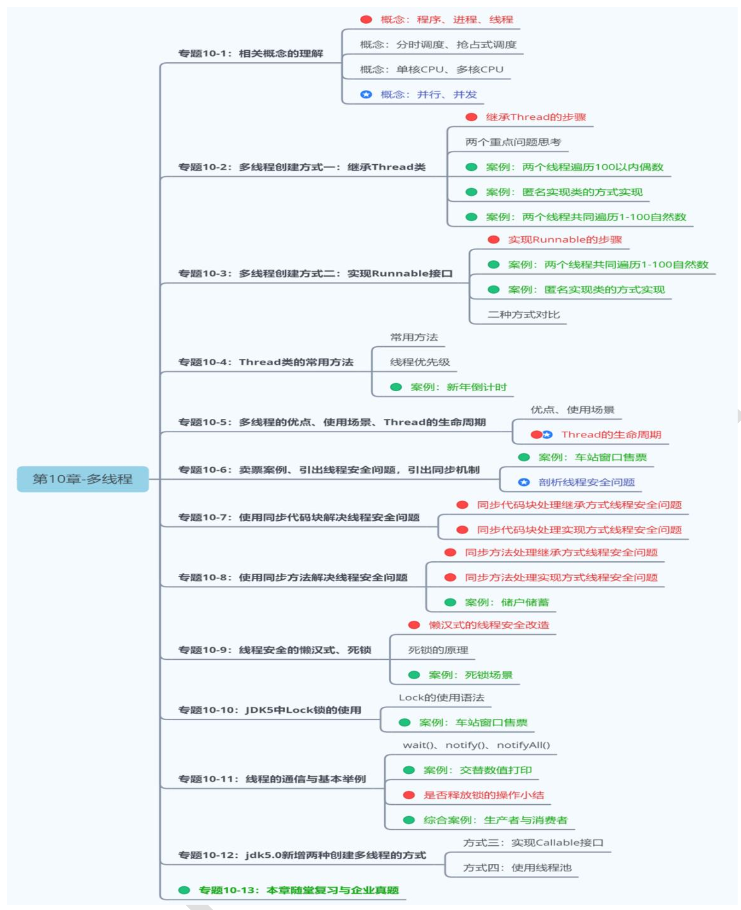
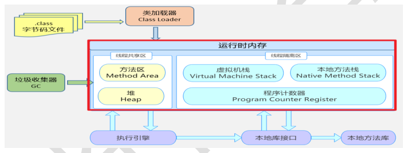
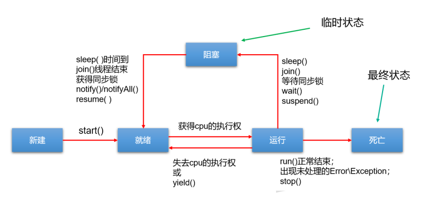
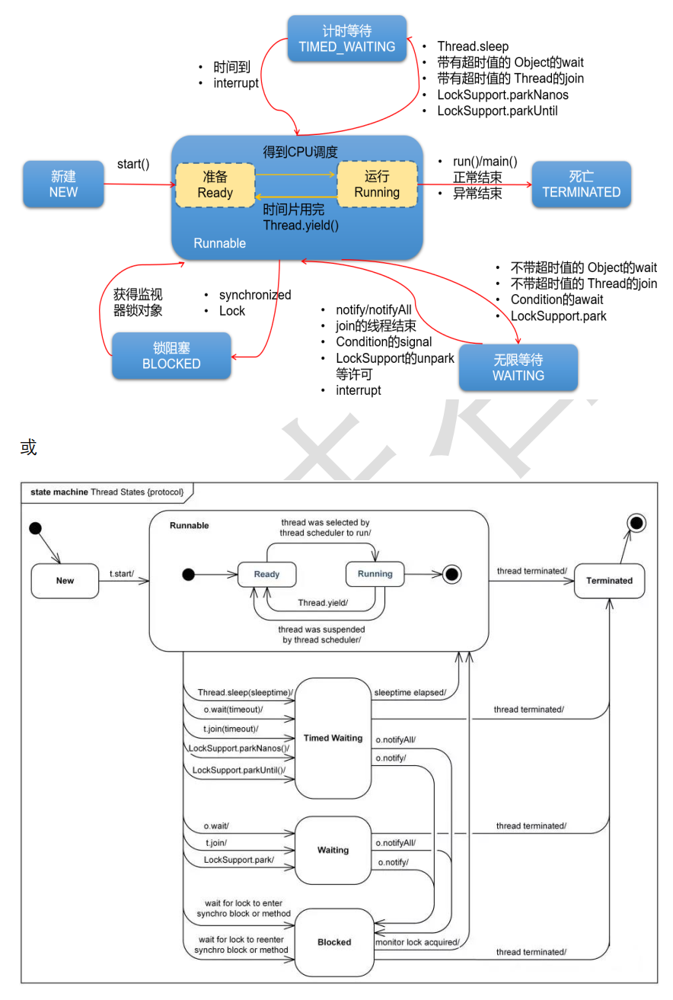
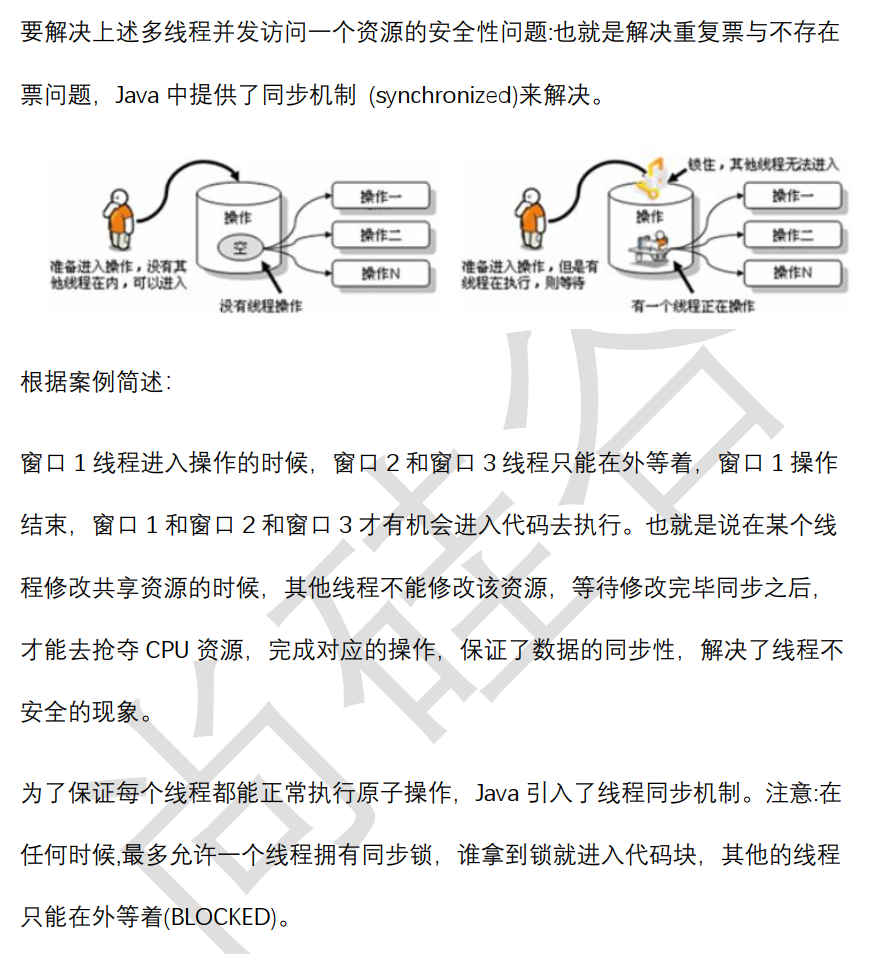
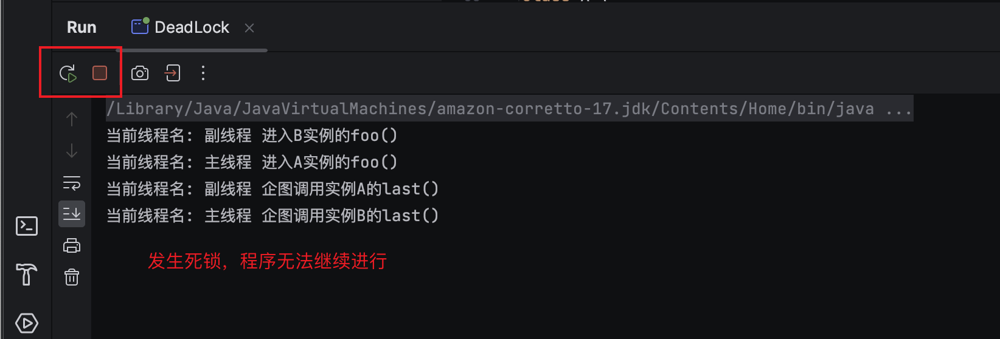
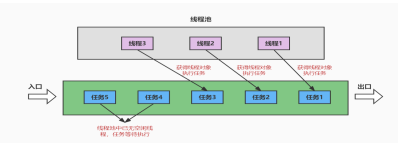

# 多线程



## 1. 相关概念
### 1.1 程序、进程和线程
* 程序(program): 为完成特定任务，用某种语言编写的一组指令集合。即一段静态代码，静态对象。
* 进程(process): 程序的一次执行过程，或是正在动态运行的应用程序。
  * 每个进程都有一个独立的内存空间，系统运行一个程序即是一个进程从创建、运行到消亡的过程。(生命周期)
  * **程序是静态的，进程是动态的。**
  * **进程**作为**操作系统调度和分配资源的最小单位**(亦是系统运行程序的基本单位)，系统在运行时会为每个进程分配不同的内存区域。
  * 现代的操作系统，大都支持多进程的，支持同时运行多个程序。
* 线程(thread): **进程**可以进一步细化为线程，是程序内部的一条执行路径。一个进程中至少有一个线程。
  * 一个进程同一时间若**并行**执行多个线程，就是支持多线程的。
  * **线程**作为CPU调度和执行的最小单位。
  * 一个**进程**中的多个线程共享相同的内存单元，它们从**同一个堆**中分配对象，可以访问相同的变量和对象。这就使得线程间通信更简便、高效。但是多个线程操作共享的系统资源可能会带来**安全的隐患**。
  * 下图中，红框的蓝色区域为线程独享，黄色区域为线程共享。
    * 
    * ⚠️注意
      * 不同的进程之间是不共享内存的。
      * 进程之间的数据交换和通信的成本很高。

### 1.2 线程调度
1. 分时调度: 所有线程**轮流**使用CPU的使用权，并且平均分配每个线程占用CPU的时间。
2. 抢占式调度: 让**优先级高**的线程以较大的概率优先使用CPU。如果线程的优先级相同，那么会随机选择一个(线程随机性)，Java使用的为抢占式调度。

### 1.3 多线程程序的优点
**背景:** 以单核 CPU 为例，只使用单个线程先后完成多个任务（调用多个方法），肯定比用多个线程来完成用的时间更短，为何仍需多线程呢？

**多线程程序的优点:**
1. 提高应用程序的响应。对图形化界面更有意义，可增强用户体验。
2. 提高计算机系统CPU的利用率。
3. 改善程序结构。将既长又复杂的进程分为多个线程，独立运行，利于理解和修改

### 1.4 补充概念
#### 1. 单核CPU和多核CPU
* 单核CPU，在一个时间单元内，只能执行一个线程的任务。
* 想要提升系统性能，只有两个办法，要么提升CPU 性能（让医生看病快点），要么多加几个CPU（多整几个医生），即为多核的CPU。

#### 2. 并行与并发
1. 并行(parallel): 指两个或多个事件在同一时刻发生（同时发生）。指在同一时刻，有多条指令在多个CPU上同时执行。
2. 并发(concurrency): 指两个或多个事件在同一个时间段内发生。即在一段时间内，有多条指令在单个 CPU 上快速轮换、交替执行，使得在宏观上具有多个进程同时执行的效果。


## 2. 创建和启动线程
### 2.1 概述
1. Java语言中的JVM允许程序运行多个线程，使用`java.lang.Thread`类代表线程，所有的线程对象都必须是Thread类或者其子类实例。
2. Thread类的特性
   * 每个线程都是通过某个特定Thread对象的`run()`方法来完成操作的，因此把`run()`方法体称为线程执行体。
   * ⚠️通过该`Thread`对象的`start()`方法来启动这个线程，而非直接调用`run()`
   * 要想实现多线程，必须在主线程中创建新的线程对象。

### 2.2 方式1: 继承`Thread`类
Java通过继承`Thread`类来创建并启动多线程，步骤如下:
1. 定义Thread类的子类，并重写`run()`方法，该`run()`方法的方法体就代表了线程需要完成的任务。
2. 创建Thread子类的实例，即创建了线程对象
3. 调用线程对象的`start()`方法来启动该线程。
4. ✅Example: `com.atguigu.thread.EvenNumberTest`

⚠️注意:
1. 如果自己手动调用`run()`方法，那么就只是调用普通方法，并没有启动多线程模式。
2. `run()`方法由JVM调用，什么时候调用，执行的过程控制都由操作系统的CPU调度决定。
3. 要启动多线程，必须调用`start()`方法。
4. 一个线程对象只能调用一次`start()`方法启动，如果重复调用，则将抛出`Exception in thread "main" java.lang.IllegalThreadStateException`

### 2.3 方式2: 实现`Runnable`接口(函数式接口)
Java有单继承的限制，当我们无法继承`Thread`类时，那么该如何做？在核心库中提供了`Runnable`接口，我们可以实现Runnable接口，重写`run()`方法，然后再调用Thread类对象代理启动和执行线程体的`run()`方法。步骤如下:
1. 定义`Runnable`接口的实现类，并重写该接口的 run()方法，该 run()方法的方法体同样是该线程的线程执行体。
2. 创建`Runnable`实现类的实例，并以此实例作为Thread的target参数来创建`Thread`对象，该`Thread`对象才是真正的线程对象。
3. 调用线程对象的`start()`方法，启动线程。调用`Runnable`接口实现类的`run()`方法。
4. ✅Example: `com.atguigu.thread.runnable.EvenNumber`

**说明:**
1. 实际上，所有的多线程代码都是通过运行`Thread`的`start()`方法来运行的。 因此，不管是继承`Thread`类还是实现`Runnable`接口来实现多线程，最终还是通过`Thread的对象的API来控制线程的，熟悉Thread类的API是进行多线程编程的基础。
2. `Runnable`对象仅仅作为Thread对象的target，Runnable实现类里包含的`run()`方法仅作为线程执行体。 而实际的线程对象依然是Thread实例，只是该`Thread`线程负责执行其target的run()方法。

### 2.4 变形写法
使用匿名内部类对象来实现线程的创建和启动
```java
// 类似于继承Thread类
new Thread("新的线程!"){
    @Override
    public void run() {
        for (int i = 0; i < 10; i++) {
            System.out.println(getName()+"：正在执行！ "+i);
        }
    }
}.start();

// 实现Runnable接口
new Thread(new Runnable(){
    @Override
    public void run() {
        for (int i = 0; i < 10; i++) {
            System.out.println(Thread.currentThread().getName() + ": " + i);
        }
    }
}).start();
```

### 2.5 对比两种方式
1. 联系: Thread类实际上也是实现了`Runnable`接口的类，即
   * `public class Thread implements Runnable`
2. 不同点
   1. 一个是类的继承(继承Thread类)，一个是接口的实现(实现Runnable接口)
   2. 继承Thread类: 线程代码存放在Thread子类的run()方法中
   3. 实现Runnable接口: 线程代码存放在接口的子类的run()方法中
3. 共同点:
    1. 启动线程，使用的都是`Thread`类中定义的`start()`
    2. 创建的线程兑现，都是Thread类或其子类

✅实现Runnable接口比继承Thread类更具优势
1. 避免了类的**单继承**的局限性
2. 多个线程可以共享一个Runnable接口的实现类,非常适合多个相同线程来处理同一份资源。更适合处理有共享数据的问题。
3. 实现了代码和线程的分离，增加了程序的健壮性，实现解耦操作，代码可以被多个线程共享，代码和线程独立。


## 3. Thread类的常用结构
### 3.1 构造器
* `public Thread()`: 分配一个新的线程对象。
* `public Thread(String name)`: 分配一个指定名字的新的线程对象。
* `public Thread(Runnable target)`: 指定创建线程的目标对象，它实现了`Runnable`接口中的`run()`方法
* `public Thread(Runnable target,String name)`: 分配一个带有指定目标新的线程对象并指定名字。

### 3.2 常用方法系列1
* `public void run()`: 此线程要执行的任务在此处定义代码。
* `public void start()`: 导致此线程开始执行; Java 虚拟机调用此线程的 run 方法。
* `public String getName()`: 获取当前线程名称。
* `public void setName(String name)`: 设置该线程名称。
* `public static Thread currentThread()`: 返回对当前正在执行的线程对象的引用。在 Thread 子类中就是 this，通常用于主线程和 Runnable 实现类
* `public static void sleep(long millis)`: 使当前正在执行的线程以指定的毫秒数暂停（暂时 停止执行）。
* `public static void yield()`: `yield()`只是让当前线程暂停一下，让系统的线程调度器重新调度一次，希望优先级与当前线程相同或更高的其他线程能够获得执行机会，但是这个不能保证，完全有可能的情况是，当某个线程调用了 yield 方法暂停之后，线程调度器又将其调度出来重新执行。

### 3.3 常用方法系列2
* `public final boolean isAlive()`: 测试线程是否处于活动状态。如果线程已经启动且尚未终止，则为活动状态。
* `void join()`: 等待该线程终止。
  * `void join(long millis)` ：等待该线程终止的时间最长为 millis 毫秒。如果 millis 时间到，将不再等待。 
  * `void join(long millis, int nanos)` ：等待该线程终止的时间最长为 millis 毫秒 + nanos 纳秒。
* `public final void stop()`： 已过时，不建议使用。强行结束一个线程的执行，直接进入 死亡状态。 run()即刻停止，可能会导致一些清理性的工作得不到完成，如文件，数据库等的关闭。同时，会立即释放该线程所持有的所有的锁，导致数据得不到同步的处理，出现数据不一致的问题。
* `void suspend() / void resume()`: 这两个操作就好比播放器的暂停和恢复。二者必须成对出现，否则非常容易发生死锁。 
  * suspend()调用会导致线程暂停，但不会释放任何锁资源，导致其它线程都无法访问被它占用的锁，直到调用 resume()。 已过时，不建议使用。

### 3.4 常用方法系列3
每个线程都有一定的优先级，同优先级线程组成先进先出队列（先到先服务），使用分时调度策略。优先级高的线程采用抢占式策略，获得较多的执行机会。每个线程默认的优先级都与创建它的父线程具有相同的优先级。

Thread 类的三个优先级常量：– MAX_PRIORITY（10）：最高优先级
* `MIN _PRIORITY`（1）：最低优先级
* `NORM_PRIORITY`（5）：普通优先级，默认情况下 main 线程具有普通优先级。
* `public final int getPriority()` ：返回线程优先级
* `public final void setPriority(int newPriority)` ：改变线程的优先级，范围在[1,10]之间。

### 3.5 守护进程
有一种线程，它是在后台运行的，它的任务是为其他线程提供服务的，这种线程被称为“守护线程”。 JVM 的垃圾回收线程就是典型的守护线程。守护线程有个特点，就是如果所有非守护线程都死亡，那么守护线程自动死亡。形象理解： 兔死狗烹， 鸟尽弓藏

调用`setDaemon(true)`方法可将指定线程设置为守护线程。必须在线程启动之前设置，否则会报 IllegalThreadStateException 异常。调用 isDaemon()可以判断线程是否是守护线程。


## 4. 多线程的生命周期
Java语言使用Thread类及其子类的对象来表示线程，在它的一个完整的生命周期中，通常要经历一下一些状态

### 4.1 JDK 1.5之前: 5种状态
线程的生命周期有五种状态：新建（New）、就绪（Runnable）、运行（Running）、阻塞（Blocked）、死亡（Dead）。 CPU 需要在多条线程之间切换，于是线程状态会多次在运行、阻塞、就绪之间切换。

1. **新建**: 当一个 Thread 类或其子类的对象被声明并创建时，新生的线程对象处于新建状态。此时它和其他 Java 对象一样，仅仅由 JVM 为其分配了内存，并初始化了实例变量的值。此时的线程对象并没有任何线程的动态特征，程序也不会执行它的线程体`run()`。
2. **就绪**: 但是当线程对象调用了`start()`方法之后，就不一样了，线程就从新建状态转为就绪状态。 JVM 会为其创建方法调用栈和程序计数器，当然，处于这个状态中的线程并没有开始运行，只是表示已具备了运行的条件，随时可以被调度。至于什么时候被调度，取决于 JVM 里线程调度器的调度。
   * ⚠️注意: 程序只能对新建状态的线程调用 start()，并且只能调用一次，如果对非新建状态的线程，如已启动的线程或已死亡的线程调用 start()都会报错 IllegalThreadStateException 异常。
3. **运行**: 如果处于就绪状态的线程获得了 CPU 资源时，开始执行 run()方法的线程体代码，则该线程处于运行状态。如果计算机只有一个 CPU 核心，在任何时刻只有一个线程处于运行状态，如果计算机有多个核心，将会有多个线程并行(Parallel)执行。当然，美好的时光总是短暂的，而且 CPU 讲究雨露均沾。对于抢占式策略的系统而言，系统会给每个可执行的线程一个小时间段来处理任务，当该时间用完，系统会剥夺该线程所占用的资源，让其回到就绪状态等待下一次被调度。此时其他线程将获得执行机会，而在选择下一个线程时，系统会适当考虑线程的优先级。
4. **阻塞**: 当在运行过程中的线程遇到如下情况时，会让出 CPU 并临时中止自己的执行，进入阻塞状态:
   * 线程调用了sleep()方法，主动放弃所占用的 CPU 资源；
   * 线程试图获取一个同步监视器，但该同步监视器正被其他线程持有；
   * 线程执行过程中，同步监视器调用了 wait()，让它等待某个通知（notify）；
   * 线程执行过程中，同步监视器调用了 wait(time)
   * 线程执行过程中，遇到了其他线程对象的加塞（join）；
   * 线程被调用 suspend 方法被挂起（已过时，因为容易发生死锁）；当前正在执行的线程被阻塞后，其他线程就有机会执行了。针对如上情况，当发生如下情况时会解除阻塞，让该线程重新进入就绪状态，等待线程调度器再次调度它。
     * 线程的sleep()时间到；
     * 线程成功获得了同步监视器；
     * 线程等到了通知(notify)；
     * 线程 wait 的时间到了
     * 加塞的线程结束了；
     * 被挂起的线程又被调用了 resume 恢复方法（已过时，因为容易发生死锁）；
5. **死亡**: 线程会以以下三种方式之一结束，结束后的线程就处于死亡状态：
   * run()方法执行完成，线程正常结束
   * 线程执行过程中抛出了一个未捕获的异常（Exception）或错误（Error）
   * 直接调用该线程的 stop()来结束该线程（已过时）

### 4.2 JDK1.5 及之后: 6种状态

* `NEW（新建）`: 线程刚被创建，但是并未启动。还没调用`start()`方法。
* `RUNNABLE（可运行）`: 这里没有区分就绪和运行状态。因为对于 Java 对象来说，只能标记为可运行，至于什么时候运行，不是 JVM 来控制的了，是 OS 来进行调度的，而且时间非常短暂，因此对于 Java 对象的状态来说，无法区分。
* `Teminated（被终止）`: 表明此线程已经结束生命周期，终止运行。
* ‼️阻塞状态: 重点说明，根据`Thread.State`的定义，阻塞状态分为三种：`BLOCKED`、 `WAITING`、
`TIMED_WAITING`。
  * `BLOCKED`（锁阻塞） ：在 API 中的介绍为：一个正在阻塞、等待一个监视器锁（锁对象）的线程处于这一状态。只有获得锁对象的线程才能有执行机会。
    * 比如，线程 A 与线程 B 代码中使用同一锁，如果线程 A 获取到锁，线程 A 进入到 Runnable 状态，那么线程 B 就进入到 Blocked锁阻塞状态。
  * `TIMED_WAITING`（计时等待）：在 API 中的介绍为：一个正在限时等待另一个线程执行一个（唤醒）动作的线程处于这一状态。
  * 当前线程执行过程中遇到 Thread 类的 sleep 或 join， Object 类的 wait， LockSupport 类的 park 方法，并且在调用这些方法时，设置了时间，那么当前线程会进入 TIMED_WAITING，直到时间到，或被中断。
  * `WAITING`（无限等待） ：在 API 中介绍为：一个正在无限期等待另一个线程执行一个特别的（唤醒）动作的线程处于这一状态。
    * 当前线程执行过程中遇到遇到 Object 类的 wait， Thread 类的join， LockSupport 类的 park 方法，并且在调用这些方法时， 没有指定时间，那么当前线程会进入 WAITING 状态，直到被唤醒。
    * 通过 Object 类的 wait 进入 WAITING 状态的要有 Object 的notify/notifyAll 唤醒；
    * 通过 Condition 的 await 进入 WAITING 状态的要有Condition 的 signal 方法唤醒；
    * 通过 LockSupport 类的 park 方法进入 WAITING 状态的要有LockSupport 类的 unpark 方法唤醒
    * 通过 Thread 类的 join 进入 WAITING 状态，只有调用 join 方法的线程对象结束才能让当前线程恢复；
    * 说明：当从 WAITING 或 TIMED_WAITING 恢复到 Runnable 状态时，如果发现当前线程没有得到监视器锁，那么会立刻转入 BLOCKED 状态。

    
## 5. 线程安全问题及解决
当我们使用多个线程访问同一资源（可以是同一个变量、同一个文件、同一条记录等）的时候，若多个线程只有读操作，那么不会发生线程安全问题。但是如果多个线程中对资源有读和写的操作，就容易出现线程安全问题

### 5.1 同一个资源问题和线程安全问题
#### 5.1.1 局部变量不能共享
```java
class TicketWindow extends Thread {
    @Override
    public void run() {
        int ticket = 100;   // 局部变量，不是共享数据
        while(ticket > 0) {
            System.out.println("卖出票号=" + ticket);
            ticket--;
        }
    }
}
```
**局部变量**(i.e.`ticket`)是每次调用方法都是独立的，那么每个线程的`run()`的资源是独立的，不是共享数据。

#### 5.1.2 不同对象的实例变量不共享
```java
class TicketWindow extends Thread {
    private int ticket = 100;   // 实例变量，不同对象之间不共享
    @Override
    public void run() {
        while(ticket > 0) {
            System.out.println("卖出票号=" + ticket);
            ticket--;
        }
    }
}
```
不同的实例对象的**实例变量**是独立的。

#### 5.1.3 静态变量是共享的
```java
class TicketWindow extends Thread {
    private static int ticket = 100;    // 静态变量在实例之间共享
    
    @Override
    public void run() {
        while(ticket > 0) {
            try {
                Thread.sleep(10);   // 加入sleep(),使得问题暴露的更明显
            } catch (InterruptedException e) {
                e.printStackTrace();
            }
            System.out.println(getName() + "卖出票号=" + ticket);
            ticket--;
        }
    }
}
```
**静态变量**在不同实例之间是共享的。

#### 5.1.4 同一个对象的实例变量共享
```java
public class SaleTicketTest {
    public static void main(String[] args) {
        TicketSaleRunnable ticketSaleRunnable = new TicketSaleRunnable();
        Thread t1 = new Thread(ticketSaleRunnable, "窗口一");
        Thread t2 = new Thread(ticketSaleRunnable, "窗口二");
        Thread t3 = new Thread(ticketSaleRunnable, "窗口三");
        
        t1.start();
        t2.start();
        t3.start();
    }
}

class TicketSaleRunnable implements Runnable {
    private int ticket = 100;

    // 线程不安全
    @Override
    public void run() { 
        while (ticket > 0) {
            try {
                Thread.sleep(10);
            } catch (InterruptedException e) {
                e.printStackTrace();
            }
            System.out.println(getName() + "卖出票号=" + ticket);
            ticket--;
        }
    }
}
```
* 线程`t1, t2, t3`共享实例变量`ticketSaleRunnable`
* 存在线程不安全的问题。
* Example: `com.atguigu.thread.safety.WindowTest`

#### 5.1.5 抽取资源类，共享同一个资源对象
```java
public class SaleTicketTest {
    public static void main(String[] args) {
        // 2. 创建资源对象
        Ticket ticket = new Ticket();
        
        // 3. 启动多个线程操作资源类对象
        new Thread("窗口1") {
            @Override
            public void run() {
                while(true) {
                    ticket.sale();
                }
            }
        };
        new Thread("窗口2") {
            @Override
            public void run() {
                while(true) {
                    ticket.sale();
                }
            }
        };
        new Thread("窗口3") {
            @Override
            public void run() {
                while(true) {
                    ticket.sale();
                }
            }
        };
        
        t1.start();
        t2.start();
        t3.start();
    }
}

// 1. 编写资源类
class Ticket {
    private int ticket = 100;   // 多个线程贡献的资源，存在线程安全问题
    
    public void sale() {
        if(ticket > 0) {
            try {
                Thread.sleep(10);   // 加入sleep(),使得问题暴露的更明显
            } catch (InterruptedException e) {
                e.printStackTrace();
            }
            System.out.println(Thread.currentThread().getName() + "卖出票号=" + ticket);
            ticket--;
        } else {
            throw new RuntimeException("没票了");
        }
    }
}
```
* 问题: 有重复票or负票的问题。
* 原因: 线程不安全。

### 5.2 同步机制解决线程安全问题
要解决上述多线程并发访问一个资源的安全性问题:也就是解决重复票与不存在票问题，Java中提供了同步机制 (`synchronized`)来解决。


#### 5.2.1 同步机制解决线程安全问题的原理
**同步机制**的原理，其实就相当于给某段代码加“锁”，任何线程想要执行这段代码，都要先获得“锁”，我们称它为**同步锁**。因为Java对象在堆中的数据分为分为对象头、实例变量、空白的填充。而**对象头**中包含：
* Mark Word: 记录了和当前对象有关的 GC、**锁标记**等信息。
* 指向类的指针: 每一个对象需要记录它是由哪个类创建出来的。
* 数组长度（只有数组对象才有）

哪个线程获得了“同步锁”对象之后，**”同步锁“对象**就会记录这个线程的ID，这样其他线程就只能等待了，除非这个线程”释放“了锁对象，其他线程才能重新获得/占用”同步锁“对象。

#### ✅5.2.2 同步代码块和同步方法
**同步代码块:** `synchronized`关键字可以用于某个区块前面，表示只对这个区块的资源实行互斥访问。格式:
```java
synchronized(同步锁){
    需要同步操作的代码
}
```

**同步方法:** `synchronized`关键字直接修饰方法，表示同一时刻只有一个线程能进入这个方法，其他线程在外面等着。
```java
public synchronized void method(){
    可能会产生线程安全问题的代码
}
```

#### 5.2.3 同步锁机制
在《Thinking in Java》中，是这么说的：对于并发工作，你需要某种方式来防止两个任务访问相同的资源（其实就是共享资源竞争）。防止这种冲突的方法就是当资源被一个任务使用时，在其上加锁。第一个访问某项资源的任务必须锁定这项资源，使其他任务在其被解锁之前，就无法访问它了，而在其被解锁之时，另一个任务就可以锁定并使用它了。

#### 5.2.4 synchronized的锁是什么
**同步锁对象**可以是任意类型，但是必须保证竞争“同一个共享资源”的多个线程必须使用同一个“同步锁对象”。

对于**同步代码块**来说，同步锁对象是由程序员手动指定的（很多时候也是指定为`this`或`类名.class`），但是对于**同步方法**来说，同步锁对象只能是默认的:
* 静态方法: 当前类的Class对象（`类名.class`）
* 非静态方法: `this`

#### 5.2.5 同步操作的思考顺序
1. 如何找问题，即代码是否存在线程安全？（非常重要） 
   1. 明确哪些代码是多线程运行的代码
   2. 明确多个线程是否有共享数据
   3. 明确多线程运行代码中是否有多条语句操作共享数据
2. 如何解决呢？（非常重要） 
   1. 对多条操作共享数据的语句，只能让一个线程都执行完，在执行过程中，其他线程不可以参与执行。 即所有操作共享数据的这些语句都要放在同步范围中
3. 切记： 
   1. 范围太小：不能解决安全问题
   2. 范围太大：因为一旦某个线程抢到锁，其他线程就只能等待，所以范围太大，
   3. 效率会降低，不能合理利用CPU资源。

**synchronized**
1. 解决了线程的安全问题
2. 弊端: 在操作共享数据时，多线程其实是串行的，意味着性能低

### 5.2.6
* 实例一: 


## 6. 再谈同步
### 6.1 单例设计模式的线程安全问题
#### 6.1.1 饿汉式没有线程安全问题
**饿汉式:** 在类初始化时就直接创建单例对象，而类初始化过程是没有线程安全问题的。

#### 6.1.2 懒汉式线程安全问题
**懒汉式:** 延迟创建对象，第一次调用`getInstance()`方法再创建对象
* ✅演示存在线程安全问题的单例模式: `com.atguigu.thread.threadsafemore.BankTest`

### 6.2 死锁
不同的线程分别占用对方需要的同步资源不放弃，都在等待对方放弃自己需要的同步资源，就形成了线程的死锁。

一旦出现死锁，整个程序既不会发生异常，也不会给出任何提示，只是所有线程处于阻塞状态，无法继续。

* ✅package: `package com.atguigu.thread.deadlock;`



#### 6.2.1 诱发死锁的原因
1. 互斥条件 
2. 占用且等待 
3. 不可抢夺(或不可抢占)
4. 循环等待

以上四个条件同时出现就会出发死锁。

#### 6.2.2 解决死锁
死锁一旦出现，基本很难人为干预，只能尽量规避。可以考虑打破上面的诱发条件。
1. 针对条件1: 互斥条件基本上无法被破坏。因为线程需要通过互斥解决安全问题。
2. **针对条件2:** 可以考虑一次性申请所有所需的资源，这样就不存在等待的问题。
3. **针对条件3:** 占用部分资源的线程在进一步申请其他资源时，如果申请不到，就主动释放掉已经占用的资源。
4. **针对条件4:** 可以将资源改为线性顺序。申请资源时，先申请序号较小的，这样避免循环等待问题。


### 6.3 JDK5.0新特性: Lock(锁)
除了使用`synchronized`同步机制处理线程安全问题之外，还可以使用JDK5.0提供的`Lock`锁的方式。

* JDK5.0的新增功能，保证线程的安全。**与采用`synchronized`相比，Lock可提供多种锁方案，更灵活、更强大。`Lock`通过显式定义同步锁对象来实现同步。同步锁使用Lock对象充当。**
* `java.util.concurrent.locks.Lock`接口是控制多个线程对共享资源进行访问的工具。锁提供了对共享资源的独占访问，每次只能有一个线程对Lock对象加锁，线程开始访问共享资源之前应先获得 Lock 对象。
* 在实现线程安全的控制中，比较常用的是 ReentrantLock，可以显式加锁、释放锁。
  * `ReentrantLock`类实现了Lock接口，它拥有与`synchronized` 相同的并发性和内存语义，但是添加了类似锁投票、定时锁等候和可中断锁等候的一些特性。此外，它还提供了在激烈争用情况下更佳的性能。
* Lock锁也称同步锁，加锁与释放锁方法，如下： 
  * `public void lock()`: 加同步锁。 
  * `public void unlock()`: 释放同步锁。
* ✅ code reference: `com.atguigu.thread.lock.LockTest`

#### 6.3.1 步骤
1. 创建`Lock`锁的实例，**确保需要多个线程共用一个Lock实例！**需要考虑将此对象声明为`static final`。
2. 执行`lock()`方法，锁定对共享资源的调用。
3. 执行`unlock()`方法，释放对共享资源的确定。

#### 6.3.2 synchronized 🆚 Lock
1. `Lock`是显式锁(手动开启和关闭锁，不要忘记关闭锁)，`synchronized`是隐式锁，出了作用域，遇到异常等自动解锁。
2. `Lock`只有代码块锁，`synchronized`有**代码块锁**和**方法锁**。
3. 使用`Lock`锁，JVM将花费较少的时间来调度线程，性能更好。并且具有更好的扩展性(提供了更多的子类)，更体现面向对象。
4. `Lock`锁可以有多种获取锁的方式，可以从sleep的线程中抢到锁，`synchronized`不可以。

**说明:** 开发中建议线程安全问题优先使用顺序为:
* Lock --> 同步代码块 --> 同步方法

#### 6.3.3 面试题
`synchronized`同步方式与`Lock`的对比？
* `synchronized`不管是同步代码块还是同步方法，都需要在一对`{}`之后，释放对同步监视器的调用
* `Lock`是通过两个方法控制需要被同步的代码，更灵活一些。
* `Lock`作为接口，提供了多种实现类，适合更复杂的场景，效率更高。


## 7. 线程的通信 -- 等待唤醒机制
### 7.1 为什么要处理线程间通信?
当**需要多个线程**共同完成一件任务，并且我们希望它们**有规律地执行**，那么多线程之间需要一些通信机制，可以协调它们的工作，以此实现多线程共同操作一份数据。

线程A与线程B之间需要**线程通信**时，可以考虑使用**等待唤醒机制**。

### 7.2 等待唤醒机制
这是多个线程间的一种协作机制。谈到线程我们经常想到的是线程之间的竞争，比如去争抢锁，但这并不是全部，线程之间也会有协作机制。

在一个线程满足某个条件时，就进入等待状态(`wait()/wait(time)`)，等待其他线程执行完成它们的指定代码过后，再将其唤醒(`notify()`)；或可以指定wait的时间，等时间到了就自动唤醒。在有多个线程进行等待时，如果需要，可以使用`notifyAll()`来唤醒所有的等待线程。`wait/notify`就是线程之间的一种**协作机制**。
1. wait(): 线程不再活动，不再参与调度，进入wait set中，因此不会浪费CPU资源，也不会去竞争锁了，此时的线程状态时WAITING或TIMED_WAITING。它还要**等到**别的线程执行一个特别的动作(即“通知”)或等待时间到了，在这个对象上等待的线程从wait set中释放出来，重新进入到调度队列中.
2. notify(): 选取所通知对象的wait set中的一个线程释放;
3. notifyAll(): 释放所通知对象的wait set中的全部线程。

⚠️注意: 被通知的线程被唤醒后也不一定能立即恢复执行，因为当初它中断的地方是在同步代码块内，而此刻它已经不再持有锁了，所以它需要再次尝试去获取锁()，成功后才能在当初调用wait()方法之后恢复执行。

**总结:**
1. 如果能获取锁，线程就从`WAITING`状态编程`RUNNABLE`(可运行)状态。
2. 否则，线程就从`WAITING`状态又编程`BLOCKED`(等待锁)状态。

### 7.3 举例
例题: 使用两个线程打印1~100，要求线程1和线程2**交替**打印。

### 7.4 调用wait()和notify()需要注意的细节
1. `wait()`方法与`notify()`方法必须要由同一个锁对象调用。因为: 对应的锁对象可以通过`notify()`唤醒使用同一个锁调用的`wait()`方法后的线程。
2. `wait()`方法与`notify()`方法属于`Object`类的方法。因为: 锁对象可以是任意对象，而任意对象的所属类都是继承了`Object`类。
3. `wait()`方法与`notify()`方法必须要在同步代码块或者同步函数中使用。因为: 必须要通过锁对象调用这2个方法，否则会报`java.lang.IllegalMonitorStateException`异常。

### 7.5 生产者与消费者问题
生产者与消费者问题中其实隐含了两个问题
1. 线程安全问题: 因为生产者与消费者共享数据缓冲区，产生线程安全问题。不过这个问题可以使用同步解决。
2. 线程的协调工作问题:
   * 要解决该问题，就必须让生产者线程在缓冲区满时等待(wait)，暂时进入阻塞状态，等到下次消费者消耗了缓冲区中的数据的时候，通知(notify)正在等待的线程恢复到就绪状态，重新开始往缓冲区添加数据。同样，也可以让消费者线程在缓冲区空时进入等待(wait)，暂时进入阻塞状态，等到生产者往缓冲区添加数据之后，再通知(notify)正在等待的线程恢复到就绪状态。通过这样的通信机制来解决此类问题。

### 7.6 面试题: 区分sleep()和wait()
`wait()` 🆚 `sleep()`
1. **相同点:** 一旦执行，当前线程都会进入阻塞状态
2. **不同点:**
    1. 声明位置不同: `wait()`声明在`Object`类中; `sleep()`声明在`Thread`类中，静态的
    2. 使用场景不同: `wait()`只能使用在同步代码块or同步方法中; `sleep()`可以在任何需要使用的场景。
    3. 使用在同步代码块or同步方法中，`wait()`一旦执行，会释放同步监视器; `sleep()`一旦执行，不会释放同步监视器。
    4. 结束阻塞的方式:
        * `wait()`: 到达指定时间自动结束阻塞or通过notify唤醒，结束阻塞。
        * `sleep()`: 到达指定时间自动结束则素。

### 7.7 是否释放锁的操作
任何线程进入同步代码块、同步方法之前，必须先获得同步监视器的锁定，那么何时会释放对同步监视器的锁定呢？

#### 7.7.1 释放锁的操作
1. 当前线程的同步方法/同步代码块执行结束。
2. 当前线程在同步方法/同步代码块中遇到`break/return`终止该方法、代码块的继续执行。
3. 当前线程在同步方法/同步代码块中出现了未处理的Error或Exception，导致当前线程异常结束。
4. 当前线程在同步方法/同步代码块中执行了**锁对象**的`wait()`方法，当前线程被挂起，并释放锁。

#### 7.7.2 不会释放锁的操作
1. 线程执行同步方法/同步代码块时，程序调用`Thread.sleep()`, `Thread.yield()`方法，暂停当前线程的执行。
2. 线程执行同步方法/同步代码块时，其他线程调用了该线程的supend()方法将该线程挂起，该线程不会释放锁(同步监视器)。
   * ⚠️注意: 应尽量避免使用`suspend()`和`resume()`这样的过时方法来控制线程。


## 8. JDK5.0新增线程创建方式
### 8.1 创建多线程的方式三: 实现Callable接口
* 与使用`Runnable`相比, `Callable`功能更强大
  * 相比`run()`方法，`Callable.call()`方法可以有返回值。
  * 方法可以抛出异常。
  * 支持范型的返回值(需要借助FutureTask类，获取返回结果)
* Future接口 (高级篇JUC中)
  * 可以对具体Runnable，Callable任务的执行结果进行取消、查询是否完成、获取结果等等。
  * FutureTask是Future接口的唯一实现类。
  * FutureTask同时实现了Runnable、Future接口。它既可以作为Runnable被线程执行，又可以作为Futurn得到Callable的返回值。
* 缺点: 在获取分线程执行结果的时候，当前线程(或主线程)受阻塞，效率较低。

### 8.2 创建多线程的方式四: 使用线程池
**现有问题:** 如果并发的线程数量很多，并且每个线程都是执行一个时间很短的任务就结束了，这样频繁地创建线程会就会大大降低系统的效率，因为频繁创建线程和销毁线程都需要时间。

那么有没有一种办法使得线程可以复用，即执行完一个任务，并不销毁，而是可以继续执行其他的任务？

**思路:** 提前创建好多个线程，放入线程池中，使用时直接获取，使用完放回线程池中。可以避免频繁创建销毁、实现重复利用。

#### 8.2.1 线程池

**优点:**
1. 提高响应速度(减少了创建新线程的时间)
2. 降低资源消耗(重复利用线程池中线程，不需要每次都创建)
3. 便于线程管理
   * `corePoolSize`: 核心池的大小
   * `maximumPoolSize`: 最大线程数
   * `keepAliveTime`: 线程没有任务时，最多保持多长时间后终止

#### 8.2.2 线程池相关的API
* JDK5.0之前，我们必须手动定义线程池。从JDK5.0开始，Java内置线程池相关的API。在`java.util.concurrent`包下提供了线程池相关的API: `ExecutorService`和`Executors`。
* `ExecutorService`: 真正的线程池接口，常见子类`ThreadPoolExecutor`
  * `void execute(Runnable command)` 执行任务/命令，没有返回值。一般用来执行Runnable
  * `<T> Future<T> submit(Callable<T> task)` 执行任务，有返回值，一般用来执行Callable。
  * `void shutdown()` 关闭链接池
* `Executors`: 一个线程池的工厂类，通过此类的静态工厂方法可以创建多种类型的线程池对象。
  * `Executors.newCachedThreadPool()` 创建一个可根据需要创建新线程的线程池。
  * `Executors.newFixedThreadPool(int nThreads)` 创建一个可重用、固定线程数的线程池。
  * `Executors.newSingleThreadExecutors()` 创建一个只有一个线程的线程池。
  * `Executors.newScheduledThreadPool(int corePoolSize)` 创建一个线程池，它可以安排在给定延迟后运行命令或者定期执行。


## 并行(parallel)与并发(concurrency)
* [`java.lang.Thread`](https://docs.oracle.com/en/java/javase/17/docs/api/java.base/java/lang/Thread.html)
> A thread is a thread of execution in a program. The Java Virtual Machine allows an application to have multiple threads of execution running concurrently.
> * 是一个执行程序的部分
> * multiple threads running concurrently
