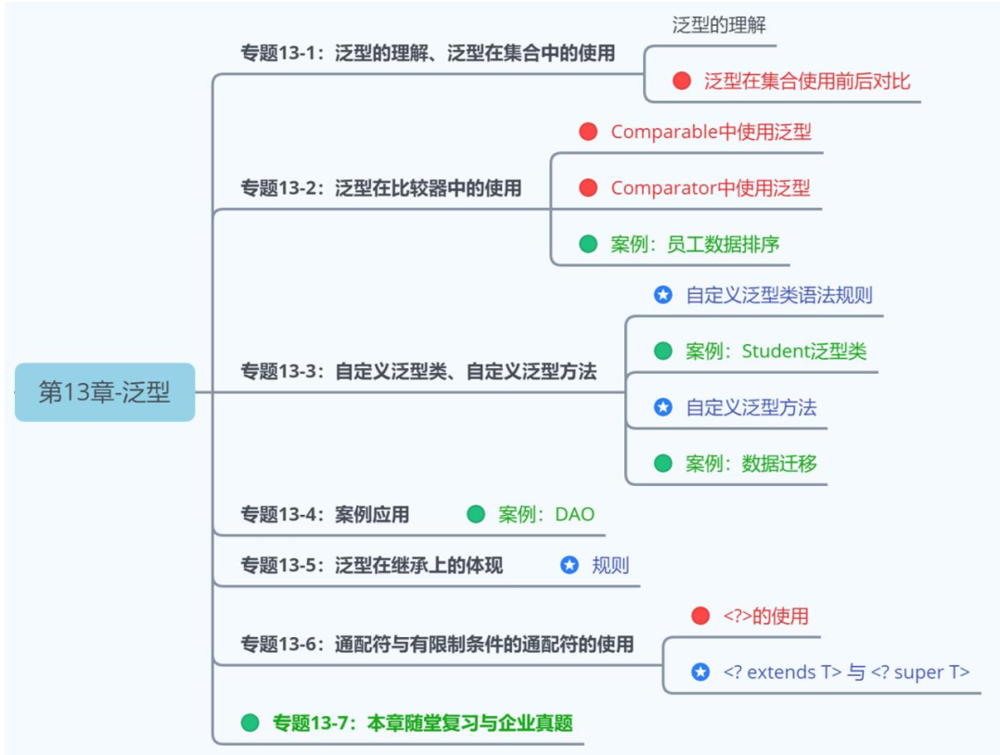

# 范型(Generic Type)

## 1. 范型概述
集合类在设计阶段/声明阶段不能确定这个容器到底实际存的是什么类型的对象，所以在JDK5.0之前只能把元素类型设计成`Object`，JDK5.0时Java引入了**参数化类型**(Parameterized type)的概念，允许我们在创建集合时指定集合元素的类型。比如`List<String>`，这表明`List`只能保存字符串类型的对象。

范型即为"类型参数"。

Java泛型可以保证如果程序在**编译时**没有发出警告，运行时就不会产生`ClassCastException`异常。即，**把不安全的因素在编译期间就排除了，而不是运行期**；既然通过了编译，那么类型一定是符合要求的，就避免了类型转换。同时，代码更加简洁、健壮。把一个集合中的内容限制为一个特定的数据类型，这就是**generic**背后的核心思想。

### 1.1 什么是泛型？
所谓**泛型**，就是允许在定义类、接口时通过一个`标识`表示类中某个`属性的类型`或者是某个方法的`返回值或参数的类型`。这个类型参数将在使用时（例如，继承或实现这个接口、创建对象或调用方法时）确定（即传入实际的类型参数，也称为类型实参）。

### 1.2 在集合中使用泛型之前可能存在的问题
1. 问题1：**类型不安全**。因为add()的参数是Object类型，意味着任何类型的对象都可以添加成功
2. 问题2：**需要使用强转操作**，繁琐。还有可能导致`ClassCastException`异常。

### 1.3 在集合、比较器中使用泛型 (重点)
* 范型在集合中的使用: `com.atguigu.chap13generic.CollectionMapTest`
* 范型在`Comparable`中的使用: `com.atguigu.chap13generic.exer1.Employee`
* 范型在`Comparator`中的使用: `com.atguigu.chap13generic.exer1.EmployeeTest.test2`

### 1.4 使用说明
> 集合框架在声明接口和其实现类时，使用了泛型（jdk5.0），在实例化集合对象时，
> * 如果没有使用泛型，则认为操作的是Object类型的数据。
> * 如果使用了泛型，则需要指明泛型的具体类型。一旦指明了泛型的具体类型，则在集合的相关的方法中，凡是使用类的泛型的位置，都替换为具体的泛型类型。

## 2. 在集合中"未使用"范型可能存在的问题

## 3. 集合，比较器

## 4. 使用说明
集合框架在声明接口和其实现类时，使用了范型(JDK5.0)。
在实例化集合对象时，
* 如果没有使用范型，则认为操作是Object类型的数据。
* 如果使用了范型，则需要指明范型的具体类型。一旦指明了范型的具体类型，则在集合的相关方法中，凡是使用类的范型的地方

## Type Inference(类型推断)
> **Type inference** is a Java compiler's ability to look at each method invocation and corresponding declaration to determine the type argument (or arguments) that make the invocation applicable.

## Reference
* [The Java Tutorials: Type Inference](https://docs.oracle.com/javase/tutorial/java/generics/genTypeInference.html)
