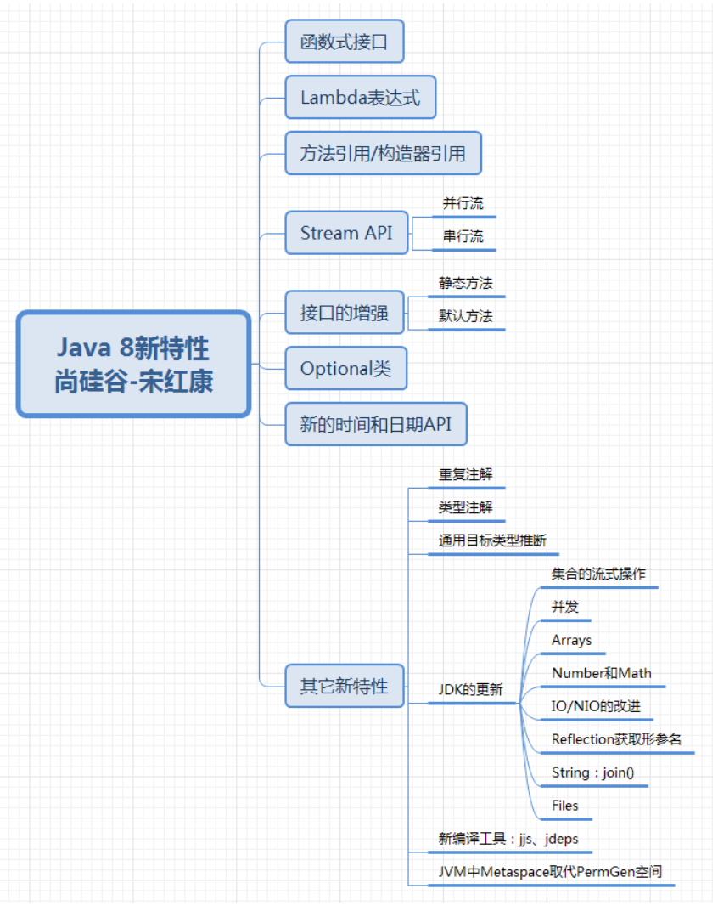

# JDK8-17新特性


**Java版本发布特点: 小步快跑，快速迭代**
* Java5.0   最重要的里程碑式版本
* Java8.0   第二重要的里程碑式版本
* Java9.0   从9.0开始，每半年更新一次
* Java11.0  LTS, 2018.9
* Java17.0  LTS, 2021.9

JEP(JDK Enhancement Proposals): JDK改提案。每当有新的设想的时候，JEP可以提出非正式的规范(specification)，被正式认可的JEP正式写进JDK的发展路线图并分配版本号。

LTS(Long-term Support): 长期支持。

### 如何学习新特性？
1. 新的语法规则(多关注)
   1. 比如自动装箱、自动拆箱，注解，enum，Lambda表达式，方法引用，switch表达式，try-catch变化，record等
2. API层面: 增加，过时，删除API
   1. StringBuilder, ArrayList, 新的日期时间的API, Optional
3. 底层的优化, JVM参数的调整, GC的变化, 内存结构(永久代-->元空间)


## 1. Lambda表达式
* `->`: Lambda操作符，箭头操作符。
* `->`的左侧: Lambda的形参列表，对应着要重写的接口中的抽象方法的形参列表。
* `->`的右侧: Lambda体，对应着接口的实现类要重写的方法的方法体。

`Lambda形参列表 -> Lambda体`

### 1.1 Lambda表达式的本质
```java
Comparator<Integer> comparator1 = (o1, o2) -> {
            System.out.println(o1);
            System.out.println(o2);
            return Integer.compare(o1, o2);
        };
```
1. 一方面，Lambda表达式作为**接口**实现类的对象 --> 万事万物皆对象
   * 左侧是一个接口类型的变量，右侧是一个接口的实现类。
   * 这些接口只有一个方法, 即**函数式接口**
2. 另一方面，Lambda表达式是一个匿名函数。
   * `(o1, o2)`对应的是方法的形参。
   * `{...}`对应的是方法的方法体。
   * 整体就是一个函数，即匿名函数。==> 匿名函数也是一个对象

### 1.2 函数式接口
1. 如果接口中只有一个抽象方法，则此接口就被称为**函数式接口**。
2. 因为只有给函数式接口提供实现类的对象时，我们才可以使用Lambda表达式。`@FunctionalInterface` (Since: 1.8)
   * `public interface Runnable`
   * `public interface Consumer<T>`
   * `public interface Comparator<T>`
   * ...

### 1.3 JDK API中函数式接口的包
> Functional interfaces provide target types for lambda expressions and method references. Each functional interface has a single abstract method, called the functional method for that functional interface, to which the lambda expression's parameter and return types are matched or adapted.
* [Package java.util.function](https://docs.oracle.com/en/java/javase/17/docs/api/java.base/java/util/function/package-summary.html)

### ✅1.4 常见的函数式接口: 四大核心函数式接口
1. `Consumer<T>`: 消费型接口, `void accept(T t)`
2. `Supplier<T>`: 供给型接口, `T get()`
3. `Function<T, R>`: 函数型接口, `R apply(T t)`
4. `Predicate<T>`: 判断型接口, `boolean test(T t)`

### 1.5 Lambda表达式语法规则总结
* 左边: Lambda的形参列表，参数的类型可以省略。如果形参只有一个，则()也可以省略
* 右边: Lambda体，对应着重写的方法的方法体。如果方法体中只有一行执行语句，则{}可以省略，如果有return关键字，则必须一并省略。
* ⚠️Code Reference: [package](../NewFeatures//src/main/java/com/ylqi007/lambda)


## 2. 方法引用 & 构造器引用
### 2.1 方法引用
1. 可以看作是基于Lambda表达式的进一步刻画。
2. 当需要提供一个函数式接口时，可以使用Lambda表达式提供此实例
   1. 当满足一定条件时，可以用方法引用or构造器引用替换Lambda表达式。
3. 方法引用的本质: **方法引用**作为了**函数式接口的实例** --> "万事万物皆对象"
   1. `Comparator<Integer> comparator = Integer::compare;`
4. 格式: 类(or对象)::方法名
   1. 对象::实例方法
      * 要求: 函数式接口中的抽象`方法a`与其内部实现时调用的**对象的**某个`方法b`的形参列表和返回值类型都相同(or一致)。此时可以考虑使用方法b实现对方法a的替换和覆盖。此替换或覆盖即为方法引用。
      * ⚠️注意: 此方法b是非静态方法，需要对象调用。
   2. 类::静态方法
      * 要求: 函数式接口中的抽象`方法a`与其内部实现时调用的**类**的某个`静态方法b`的形参列表和返回值类型都相同(or一致)。此时可以考虑使用方法b实现对方法a的替换和覆盖。此替换或覆盖即为方法引用。
      * ⚠️注意: 此方法b是**静态方法**，需要类调用。
   3. 类::实例方法
      * 要求: 函数式接口中的抽象`方法a`与其内部实现时调用的**对象的**某个`方法b`的返回值类型一致，同时，抽象方法a的第一个参数作为方法b的调用者，且抽象方法a的后N-1个参数与方法b的N-1个参数的类型相同or一致，则可以考虑使用方法b实现对抽象方法a的替换/覆盖。此替换/覆盖即为方法引用。
      * ⚠️注意: 此方法b是非静态方法，需要对象调用。但是形式上，写成对象a所属的类
5. :white_check_mark: Code Reference: [package `com.ylqi007.reference`](../src/main/java/com/ylqi007/reference)

### 2.2 构造器引用
1. 将构造器引用看作特殊的方法引用。
2. 格式: `类名::new`
3. 说明:
   1. 调用了类名对应的类中的某一个确定的构造器
   2. 具体调用的是类中的哪一个构造器？取决于函数式接口的抽象方法的形参列表。
4. :white_check_mark: Code Reference: [package `com.ylqi007.reference`](../src/main/java/com/ylqi007/reference)

### 2.3 数组引用
1. 格式: `数组类型[]::new`
2. :white_check_mark: Code Reference: [package `com.ylqi007.reference`](../src/main/java/com/ylqi007/reference)


## 3. Stream API
* Java8中两大最为重要的改变: 第一个是Lambda表达式，另一个就是Stream API
* Stream API(java.util.stream)把真正的函数式编程风格引入到了Java中。这是目前位置对Java类库最好的补充，因为Stream API可以极大提供Java程序员的生产力，让程序员写出高效、干净、简洁的代码。
* Stream 是 Java8 中处理集合的关键抽象概念，它可以指定你希望对集合进行的操作，可以执行非常复杂的查找、过滤和映射数据等操作。**使用Stream API对集合数据进行操作，就类似于使用SQL执行的数据库查询。** 也可以使用 Stream API 来并行执行操作。简言之， Stream API 提供了一种高效且易于使用的处理数据的方式。

### 3.1 什么是Stream
Stream是数据渠道，用于操作数据源（集合、数组等）所生成的元素序列。

**Stream API 和集合框架的区别:**
1. Stream API关注的是多个数据的计算()，面向CPU。集合关注的是数据存储，面向内存。
2. Stream API之于集合，类似于SQL之于数据库标的查询。

⚠️**注意:**
1. Stream自己并不会存储元素。
2. Stream不会改变源对象。相反，它们会返回一个持有结果的新Stream。
3. Stream操作是延迟执行的。这意味着它们会等到需要结果的时候才执行。即一旦执行终止操作，就执行中间操作链，并产生结果。
4. Stream一旦执行了终止操作，就不能再调用其他中间操作或终止操作了。

### 3.2 Stream使用步骤
1. Stream的实例化
   1. 方式一: 通过集合。Java8中`java.util.Collection`接口提供了两个获取Stream的方法
      * `default Stream<E> stream()` 返回一个顺序流
      * `default Stream<E> parallelStream()` 返回一个并行流
   2. 方式二: 通过数组。Java8中Arrays的静态方法`stream()`可以获取数组流
      * `public static <T> Stream<T> stream(T[] array)`
      * `public static IntStream stream(int[] array)`
      * `public static LongStream stream(long[] array)`
   3. 方式三: 通过调用静态方法`Stream.of(...)`，通过显示值创建一个Stream。他可以接收任意数量的参数。
      * `public static<T> Stream<T> of(T t)`
      * `public static<T> Stream<T> ofNullable(T t)`
      * `public static<T> Stream<T> of(T... values)`
2. 一些列的中间操作
   1. 筛选与切片
      * `filter()`
      * `distinct()`
      * `limit()`
      * `skip()`
      * `max()`
      * `min()`
   2. 映射
      * `map(Function f)`
      * `mapToInt(ToIntFunction f)`
      * `mapToDouble(ToDoubleFunction f)`
      * `flatMap(Function f)`: 接收一个函数作为参数，将流中的每个值都换成另一个流，然后把所有流链接成一个流
   3. 排序
      * `sorted()` 产生一个新Stream，自然排序 (⚠️注意: 元素要实现Comparable接口)
      * `sorted(Comparator cmp)` 产生一个新Stream，按照比较器排序
3. 执行终止操作: 
   * 终端操作会从stream的流水线生成结果。其结果可以是任何不是流的值，例如: List, Integer, 甚至是void。
   * **当stream进行了终止操作后，不能再次使用。**
   1. 匹配与查找
      * `allMatch(Predicate p)`
      * `anyMatch(Predicate p)`
      * `nonMatch(Predicate p)`
      * `findFirst()`
      * `findAny()`
      * `count()`
      * `max(Comparator cmp)`
      * `min(comparator cmp)`
      * `forEach(Consumer c)`
   2. 归约
      * `reduce(T identity, BinaryOperator b)`
      * `reduce(BinaryOperator b)` 可以将stream中元素反复结合起来，得到一个值。返回Optional
      * ⚠️注意: Map和Reduce的连接通常称为map-reduce模式，因Google用它进行网络搜索而出名。
   3. 收集
      * `collect(Collector c)` 将stream转换为其他形式。接收一个Collector接口的实现，用于给Stream中元素做汇总的方法。`Collector`接口中方法的实现决定了如何对stream执行收集的操作(如收集到List, Set, Map)。另外，`Collector`实用类提供了很多静态方法，可以方便地创建常见收集器实例。
        * `toList()`
        * `toSet()`
        * `toCollection()`
 

## 4. 新的语法
新的语法结构勾勒出了Java语法进化的一个趋势，将开发者从复杂、繁琐的低层次抽象中逐渐解放出来，以更高层次、更优雅的抽象，既降低代码量，又避免意外编程错误的出现，进而提高代码质量和开发效率。

### 4.1 Java的REPL工具: jShell命令
1. 命令行中通过指令`jshell`，调取jshell工具

2. 常用指令:
```jshelllanguage
/help: 获取有关使用 jshell 工具的信息

/help intro : jshell 工具的简介

/list : 列出当前 session 里所有有效的代码片段

/vars : 查看当前 session 下所有创建过的变量

/methods : 查看当前 session 下所有创建过的方法

/imports : 列出导入的包

/history : 键入的内容的历史记录

/edit : 使用外部代码编辑器来编写 Java 代码

/exit : 退出 jshell 工具
```

### 4.2 异常处理之try-catch资源关闭
JDK7的新特性: 在try后面增加一个`()`，在括号中可以声明流对象并初始化。try中代码执行完毕之后，会自动被流对象释放，就不用再写finally了。

**说明:**
1. 在`try()`中声明的资源，无论是否发生异常，无论是否处理异常，都会自动关闭资源对象，不用手动关闭了。
2. 这些资源必须实现`AutoCloseable`或`Closeable`接口，实现其中的`close()`方法。`Closeable`是 `AutoCloseable`的子接口。 Java7几乎把所有的“资源类”（包括文件 IO 的各种类、 JDBC 编程的 Connection、 Statement 等接口…）都进行了改写，改写后资源类都实现了`AutoCloseable`或`Closeable`接口，并实现了 close()方法。
3. 写到`try()`中的资源类的变量默认是`final`声明的，不能修改。

JDK9新特性: 可以在try前面定义流对象，try后面的()中可以直接引用流对象的名称。在try代码执行完毕后，流对象也可以释放，也不用再写finally了。

### 4.3 局部变量类型推断
JDK10的新特性: 局部变量的**显示类型声明**，常常被认为是不必须的，给一个好听的名字反而可以很清楚的表达出下面应该怎样继续。本新特性允许开发人员省略通常不必要的局部变量类型声明，以增强Java语言的体验性、可读性。

**不适用场景:**
* 声明一个成员变量
* 声明一个数组变量，并为数组静态初始化（省略new的情况下）
* 方法的返回值类型
* 方法的参数类型
* 没有初始化的方法内的局部变量声明
* 作为catch块中异常类型
* Lambda表达式中函数式接口的类型
* 方法引用中函数式接口的类型

### 4.4 instanceof的模式匹配
* JDK14中预览特性: `instanceof`模式匹配通过提供更为简便的语法，来提高生产力。有了该功能，可以减少Java程序中显式强制转换的数量，实现更精确、简洁的类型安全的代码。
* JDK15中第二次预览: 没有任何更改。
* JDK16中转正特性: 在Java16中转正。

### 4.5 Switch表达式
* JDK12中预览特性: switch表达式
* JDK13中二次预览特性: switch表达式
* JDK14中转正特性: switch表达式
* JDK17的预览新特性: switch的模式匹配，需要`--enable-preview`以启用patterns in switch statements
   * 

**传统switch声明语句的弊端:**
1. 匹配是自上而下的，如果忘记写 break，后面的 case 语句不论匹配与否都会执行； ---> case 穿透
2. 所有的 case 语句共用一个块范围，在不同的 case 语句定义的变量名不能重复；
3. 不能在一个 case 里写多个执行结果一致的条件；
4. 整个 switch 不能作为表达式返回值；

**JDK12中预览特性:**
* JDK12中对`switch`声明语句进行扩展，使用`case L -> ...`来替代以前的 `break;`，省去了break语句，避免了因少写`break`而出错。
* 同时将多个case合并到一行，显得简洁、清晰，也更加优雅的表达逻辑分支。
* 为了保持兼容性，case条件语句中依然可以使用字符`:`，但是同一个switch结构里不能混用`->`和`:`，否则编译错误。

**JDK13中二次预览特性:**
* JDK13中引入了`yield`语句，用于返回值。这意味着，switch表达式(返回值)应该使用yield，switch语句(不返回值)应该使用 break。
* **yield和return的区别在于:** return会直接跳出当前循环或者方法，而yield只会跳出当前switch块。

**JDK14中转正特性:** 以上switch表达式是JDK12和JDK13中的预览特性，现在是正式特性了。

**JDK17的预览特性:** switch的模式匹配
* 直接在switch上支持Object类型，这就等于同时支持多种类型，使用模式匹配得到具体类型，大大简化了语法量，这个功能很实用。

### 4.6 文本块使用
* JDK13的预览特性
* JDK14中二次预览特性
* JDK15中功能转正
  
**现实问题:** 在Java中，通常需要使用String类型表达HTML，XML，SQL或JSON等格式的字符串，在进行字符串赋值时需要进行转义和连接操作，然后才能编译该代码，这种表达方式难以阅读并且难以维护。

**JDK13的新特性:** 使用`"""`作为文本块的开始符和结束符，在其中就可以放置多行的字符串，不需要进行任何转义。因此，文本块将提高Java程序的可读性和可写性。

**JDK14 中二次预览特性:** JDK14 的版本主要增加了两个 escape sequences，分别是
* `\` line-terminator
* `\s` escape sequence

**JDK15中功能转正**

### 4.7 record
* JDK14中预览特性
* JDK15中第二次预览特性
* JDK16中转正特性

**JDK14中预览特性:** 实现一个简单的数据载体类，为了避免编写:构造函数，访问器，equals()，hashCode()，toString()等，Java 14 推出`record`。

`record`是一种全新的类型，它本质上是一个`final`类，同时所有的属性都是final修饰，它会自动编译出`public get`、`hashcode()`、`equals()`、`toString()`、构造器等结构，减少了代码编写量。具体来说:当你用 record声明一个类时，该类将自动拥有以下功能:
* 获取成员变量的简单方法，比如例题中的 name() 和 partner() 。注意区别于我们平常getter()的写法。
* 一个`equals()`方法的实现，执行比较时会比较该类的所有成员属性。
* 重写`hashCode()`方法。
* 一个可以打印该类所有成员属性的`toString()`方法。
* 只有一个构造方法。

此外:
* 还可以在`record`声明的类中定义静态字段、静态方法、构造器或实例方法。
* 不能在`record`声明的类中定义实例字段；类不能声明为 abstract；不能声明显式的父 类等。

**JDK15 中第二次预览特性**

**JDK16 中转正特性**

⚠️记录不适合哪些场景: `record`的设计目标是提供一种将数据建模为数据的好方法。它也不是JavaBeans 的直接替代品，因为record的方法不符合JavaBeans的get标准。另外JavaBeans通常是可变的，而记录是不可变的。尽管它们的用途有点像，但记录并不会以某种方式取代JavaBean。

### 4.8 密封类
背景:在Java中如果想让一个类不能被继承和修改，这时我们应该使用`final`关键字对类进行修饰。不过这种要么可以继承，要么不能继承的机制不够灵活，有些时候我们可能想让某个类可以被某些类型继承，但是又不能随意继承，是做不到的。Java15尝试解决这个问题，引入了`sealed类，被sealed修饰的类可以指定子类。这样这个类就只能被指定的类继承。

**JDK15的预览特性:** 通过密封的类和接口来限制超类的使用，密封的类和接口限制其它可能继承或 实现它们的其它类或接口。

具体使用:
* 使用修饰符 `sealed`，可以将一个类声明为密封类。密封的类使用保留关键字 `permits` 列出可以直接扩展（即 extends）它的类。
* `sealed` 修饰的类的机制具有传递性，它的子类必须使用指定的关键字进行修饰，且只能是`final`、`sealed`、`non-sealed`三者之一。

**JDK16 二次预览特性**

**JDK17 中转正特性**

## 5. 增加、过时，删掉的API
### 5.1 Optional类
**JDK8 的新特性:** 到目前为止，臭名昭著的空指针异常是导致 Java 应用程序失败的最常见原因。 以前，为了解决空指针异常，Google在著名的**Guava**项目引入了`Optional`类，通过检查空值的方式避免空指针异常。受到 Google 的启发，`Optional`类已经成为 Java 8 类库的一部分。

`Optional<T>` 类(java.util.Optional) 是一个容器类，它可以保存类型T的值，代表这个值存在。或者仅仅保存 null，表示这个值不存在。如果值存在，则isPresent()方法会返回 true，调用 get()方法会返回该对象。
Optional 提供很多有用的方法，这样我们就不用显式进行空值检测。

**1. 创建 Optional 类对象的方法:**
1. `static Optional empty()` :用来创建一个空的 Optional 实例
2. `static Optional of(T value)` :用来创建一个 Optional 实例， value 必须非 空
3.` static <T> Optional<T> ofNullable(T value)` :用来创建一个 Optional 实例， value 可能是空，也可能非空

**2. 判断 Optional 容器中是否包含对象:**
1. `boolean isPresent()` : 判断 Optional 容器中的值是否存在
2. `void ifPresent(Consumer<? super T> consumer)` :判断 Optional 容器中的值是否存在，如果存在，就对它进行 Consumer 指定的操作，如果不存在就不做

**3. 获取 Optional 容器的对象:**
1. `T get()`: 如果调用对象包含值，返回该值。否则抛异常。 T get()与 of(T value)配合使用
2. ` T orElse(T other)`: orElse(T other) 与 ofNullable(T value)配合使用，如果 Optional 容器中非空，就返回所包装值，如果为空，就用 orElse(T other)other 指定的默认值（备胎）代替
3. ` T orElseGet(Supplier<? extends T> other)`: 如果 Optional 容器中非空，就返回所包装值，如果为空，就用 Supplier 接口的 Lambda 表达式提供的值代替T orElseThrow(Supplier<? extends X> exceptionSupplier) :如果 Optional 容器中非空，就返回所包装值，如果为空，就抛出你指定的异常类型代替原来的NoSuchElementException

### 5.2 String存储结构和API变更

### 5.3 JDK17: 标记删除Applet API
Applet API 提供了一种将 Java AWT/Swing 控件嵌入到浏览器网页中的方法。不过，目前 Applet 已经被淘汰。大部分人可能压根就没有用过 Applet。Applet API 实际上是无用的，因为所有 Web 浏览器供应商都已删除或透露计
划放弃对 Java 浏览器插件的支持。 Java 9 的时候， Applet API 已经被标记为过时， Java 17 的时候终于标记为删除了。

具体如下:
```java
java.applet.Applet
java.applet.AppletStub
java.applet.AppletContext
java.applet.AudioClip
javax.swing.JApplet
java.beans.AppletInitialize
```

## 6. 其他
### 6.1 JDK9: UnderScore(下划线)使用的限制

### 6.2  JDK11:更简化的编译运行程序

### 6.3 GC 方面新特性
GC是Java 主要优势之一。 然而，当GC停顿太长，就会开始影响应用的响应时间。随着现代系统中内存不断增长，用户和程序员希望 JVM 能够以高效的方式充分利用这些内存，并且无需长时间的GC暂停时间。

#### 1. G1 GC
**JDK9**以后默认的垃圾回收器是`G1GC`。

**JDK10:** 为G1提供并行的Full GC
* G1最大的亮点就是可以**尽量**的避免full gc。但毕竟是“尽量”，在有些情况下，G1就要进行full gc了，比如如果它无法足够快的回收内存的时候，它就会**强制停止所有的应用线程然后清理**。在Java10之前，一个单线程版的标记-清除-压缩算法被用于full gc。为了尽量减少full gc带来的影响，在Java10中，就把之前的那个**单线程版**的标记-清除-压缩的full gc算法改成了**支持多个线程**同时full gc。这样也算是减少了full gc所带来的停顿，从而提高性能。
* 你可以通过`-XX:ParallelGCThreads`参数来指定用于并行GC的线程数。

**JDK12:**可中断的G1 Mixed GC
**JDK12:**增强G1，自动返回未用堆内存给操作系统

#### 2. Shenandoah GC
**JDK12:** Shenandoah GC: **低停顿时间**的GC。
* Shenandoah垃圾回收器是 Red Hat 在2014年宣布进行的一项垃圾收集器研究项目Pauseless GC的实现，旨在针对 JVM上的内存收回实现低停顿的需求。据Red Hat研发Shenandoah团队对外宣称，Shenandoah垃圾回收器的暂停时间与堆大小无关，这意味着无论将堆设置为200MB还是200GB都将拥有一致的系统暂停时间，不过实际使用性能将取决于实际工作堆的大小和工作负载。
* Shenandoah GC主要目标是99.9%的暂停小于10ms，暂停与堆大小无关等。这是一个实验性功能，不包含在默认（Oracle）的 OpenJDK 版本中。

**JDK15:** Shenandoah GC垃圾回收算法转正

#### 3. 革命性的 ZGC
**JDK11:** 引入革命性的 ZGC
* ZGC，这应该是JDK11最为瞩目的特性，没有之一。ZGC是一个并发、基于region、压缩型的垃圾收集器。
* ZGC的设计目标是: 支持TB级内存容量，暂停时间低（<10ms），对整个程序吞吐量的影响小于15%。将来还可以扩展实现机制，以支持不少令人兴奋的功能，例如多层堆（即热对象置于DRAM和冷对象置于NVMe闪存），或压缩堆。

**JDK13:** ZGC:将未使用的堆内存归还给操作系统

**JDK14:** ZGC on macOS 和 windows
* JDK14之前，ZGC仅Linux才支持。现在MacOS或Windows上也能使用 ZGC 了，示例 如下:
   * `-XX:+UnlockExperimentalVMOptions -XX:+UseZGC`
* ZGC与Shenandoah 目标高度相似，在尽可能对吞吐量影响不大的前提下，实现在任意堆内存大小下都可以把垃圾收集的停顿时间限制在十毫秒以内的低延迟。

**JDK15:** ZGC功能转正
* ZGC是Java 11引入的新的垃圾收集器，经过了多个实验阶段，自此终于成为正式特性。
* 但是这并不是替换默认的GC，默认的GC仍然还是 G1；之前需要通过`-XX:+UnlockExperimentalVMOptions、 -XX:+UseZGC`来启用ZGC，现在只需要`-XX:+UseZGC`就可以。相信不久的将来它必将成为默认的垃圾回收器。
ZGC的性能已经相当亮眼，用“令人震惊、革命性”来形容，不为过。未来将成为服务端、大内存、低延迟应用的首选垃圾收集器。

怎么形容 Shenandoah 和 ZGC 的关系呢？异同点大概如下:
• 相同点: 性能几乎可认为是相同的
• 不同点: ZGC是Oracle JDK的，根正苗红。而 Shenandoah 只存在于OpenJDK 中，因此使用时需注意你的JDK版本

**JDK16: ZGC并发线程处理**
在线程的堆栈处理过程中，总有一个制约因素就是**safepoints**。在safepoints这个点，Java的线程是要暂停执行的，从而限制了GC的效率。

**回顾:** 我们都知道，在之前，需要GC的时候，为了进行垃圾回收，需要所有的线程都暂停下来，这个暂停的时间我们称为**Stop The World**。而为了实现STW这个操作，JVM需要为每个线程选择一个点停止运行，这个点就叫做安全点（Safepoints）。而ZGC的并发线程堆栈处理可以保证Java线程可以在GC safepoints的同时可以并发执行。它有助于提高所开发的Java软件应用程序的性能和效率。


## 7. 小结与展望
随着云计算和AI等技术浪潮，当前的计算模式和场景正在发生翻天覆地的变化，不仅对 Java 的发展速度提出了更高要求，也深刻影响着 Java 技术的发展方向。传统的大型企业或互联网应用，正在被云端、容器化应用、模块化的微服务甚至是函数(FaaS， Function-as-a-Service)所替代。

Java需要在新的计算场景下，改进开发效率。比如，Java代码虽然进行了一些类型推断等改进，更易用的集合API等，但仍然给开发者留下了过于刻板、形式主义的印象，这是一个长期的改进方向。

Java虽然标榜面向对象编程，却毫不顾忌的加入面向接口编程思想，又扯出匿名对象的概念，每增加一个新的东西，对 Java的根本（面向对象思想）的一次冲击。