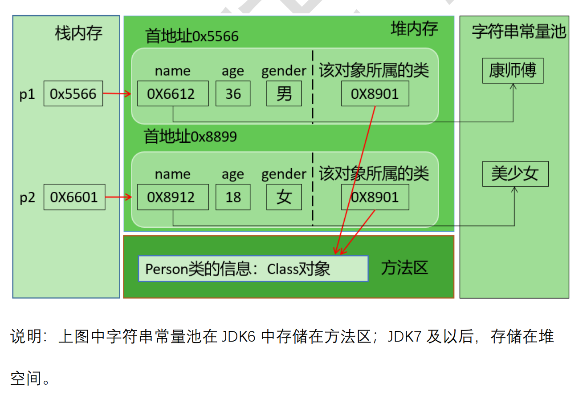
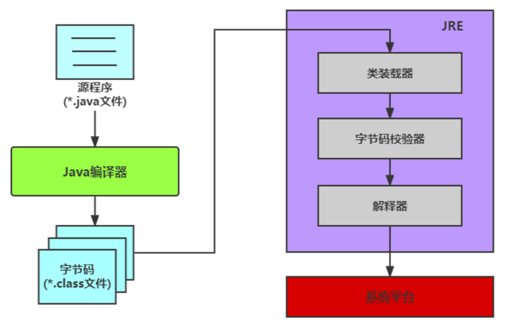
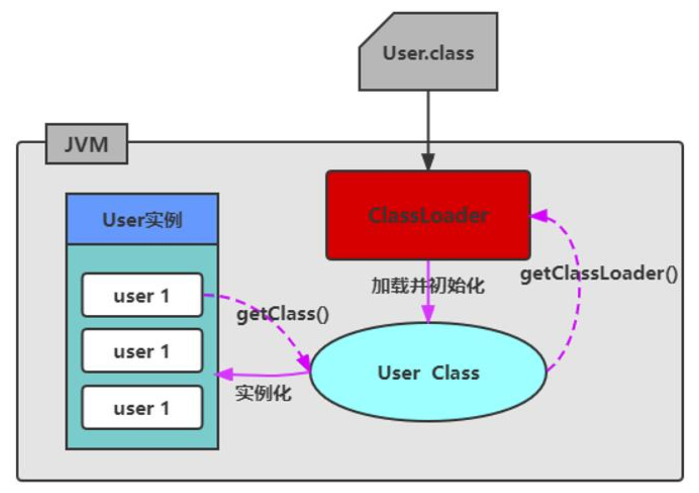
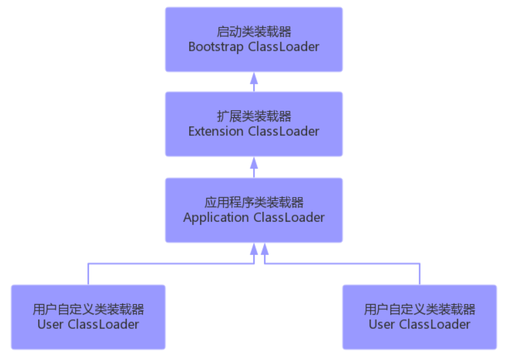
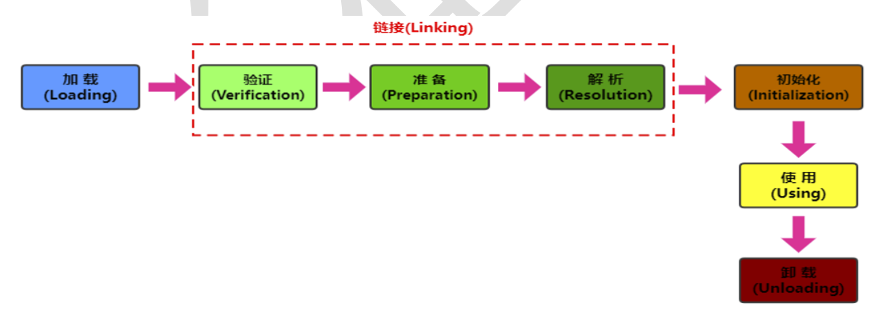
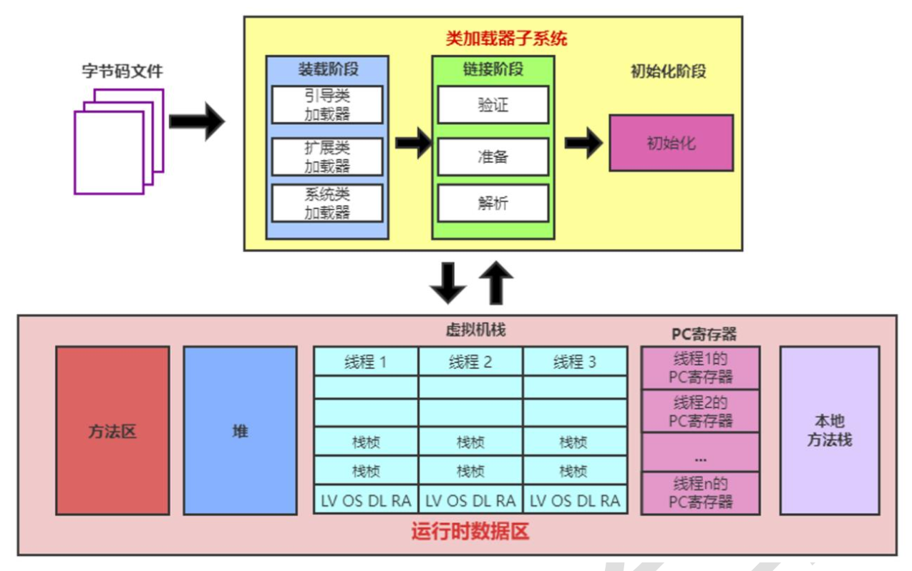

[toc]

# Java反射机制

## 1. 反射(Reflection)的概念
### 1.1 反射的出现背景
在Java程序中，所有的对象都有两种类型：**编译时类型**和**运行时类型**，而在很多时候，对象的编译时类型和运行时类型不一致。
比如
```java
Object obj = new String("Hello");
obj.getClass();
```
在上述代码片段中，在定义变量`obj`时，它的声明类型是`Object`，但是程序需要调用该对象运行时类型的方法时，该方法不是`Object`中的方法，那么该如何解决？
1. **方案1:** 在编译和运行时都完全知道类型的具体信息，在这种情况下，可以直接先使用`instanceof`运算符进行判断，再使用强制类型转换符将其转换成运行时类型的变量即可。
2. **方案2:** 编译时根本无法预知该对象和类的真实信息，程序只能依靠运行时信息来发现该对象和类的真实信息，这就必须使用反射。

### 1.2 反射概述
反射(Reflection)是被是为**动态语言**的关键，反射机制运行程序在运行期间借助Reflection API取得**任何类**的内部信息，并能直接操作任意对象的内部属性及方法。

加载完类之后，在堆内存的方法区中就产生了一个`Class`类型的对象（一个类 只有一个Class对象），这个对象就包含了完整的类的结构信息。我们可以通过这个对象看到类的结构。

### 1.3 Java反射机制提供的功能
* 在运行时判断任意一个对象所属的类
* 在运行时构造任意一个类的对象
* 在运行时判断任意一个类所具有的成员变量和方法
* 在运行时调用任意一个对象的成员变量和方法
* 在运行时获取范型信息
* 在运行时处理注解
* 生成动态代理

### 1.4 反射相关的主要API
* `java.lang.Class`: 代表一个类
* `java.lang.reflect.Method`: 代表类的方法
* `java.lang.reflect.Field`: 代表类的成员变量 
* `java.lang.reflect.Constructor`: 代表类的构造器


## 2. 理解Class类并获取Class实例
### 2.1 理论上
在`Object`类中定义了以下方法，此方法被所有子类继承:
```java
public final Class getClass()
```
以上方法返回值的类型是一个`Class`类，此类是Java反射的源头，时加上所谓反射，从程序运行的结果来看，就是可以通过对象反射求出类的名称。

对每个类而言，JRE都为其保留一个不变的Class类型的对象。一个Class对象包含了特定某个结构(class/interface/enum/annotation/primitive type/void/[])的有关信息。
* Class本身也是一个类
* Class对象只能由系统建立对象
* 一个加载的类在JVM中只会有一个Class实例
* 一个Class对象对应的是一个加载到JVM中的.class文件
* 每个类的实例都会记得自己是由哪个Class实例所生成的
* 通过Class可以完整地得到一个类中的所有被加载的结构
* Class类是Reflection的根源，针对任何你想动态加载、运行的类，唯有先获得相应的Class对象

### 2.2 内存结构上


### 2.3 获取Class类的实例(四种方法)
1. 方法1: 要求编译期间已知类型
   * 前提: 若已知具体的类型，通过类的class属性获取，该方法最为安全可靠，程序性能最高。
   * `Class clazz = String.class`
2. 获取对象的运行时类型
   * 前提: 已知某个类的实例，调用该实例的`getClass()`方法获取Class对象
   * `Class clazz = "www.atguigu.com".getClass()` 获取String对象的类
3. 可以获取编译期间未知的类型
   * 前提: 已知一个类的全类名，且在该类的类路径下，可以通过Class类的静态方法`forName()`获取，可能抛出`ClassNotFoundException`
   * `Class clazz = Class.forName("java.lang.String")`
4. 其他方式(不做要求)
   * 前提: 可以用系统类加载器对象或自定义加载器对象加载指定路径下的类型
   * `ClassLoader classLoader = this.getClass().getClassLoader(); Class clazz = classLoader.loadClass("类的全类名")`

### 2.4 哪些类型可以有Class对象
简而言之，所有Java类型！
1. class: 外部类，成员(成员内部类，静态内部类), 局部内部类，匿名内部类
2. interface: 接口
3. []: 数组
4. enum: 枚举
5. annotation: 注解，`@interface`
6. primitive type: 基本数据类型
7. void: 

```java
    @Test
    public void test2() {
        Class c1 = Object.class;
        Class c2 = Comparable.class;
        Class c3 = String[].class;
        Class c4 = int[][].class;
        Class c5 = ElementType.class;
        Class c6 = Override.class;
        Class c7 = int.class;
        Class c8 = void.class;
        Class c9 = Class.class;

        int[] a = new int[10];
        int[] b = new int[100];
        Class c10 = a.getClass();
        Class c11 = b.getClass();
        // 只要元素类型与维度一样，就是同一个Class
        System.out.println(c10 == c11);
    }
```

### 2.5 Class类的常用方法
* [java.lang.Class<T>](https://docs.oracle.com/en/java/javase/17/docs/api/java.base/java/lang/Class.html)
* [Package java.lang.reflect](https://docs.oracle.com/en/java/javase/17/docs/api/java.base/java/lang/reflect/package-summary.html)


## 3. 类加载器&类的加载过程
### 3.1 类的加载器

1. 作用: 将class文件字节码内容加载到内存中，并将这些静态数据转换成方法区的运行时数据结构，然后在堆中生成一个代表这个类的`java.lang.Class`对象，作为方法区中类数据的访问入口。
   * 类缓存: 标准的JavaSE类加载器可以按要求查找类，但一旦某个类被加载到类加载器中，它将维持加载器(缓存)一段时间。不过JVM垃圾回收机制可以回收这些Class对象。
   * 
2. 类加载器的分类(以JDK8为例): JVM支持两种类型的类加载器，分别为引导类加载器(Bootstrap ClassLoader)和自定义类加载器(User-Defined ClassLoader)。在Java虚拟机规范中，将所有派生于抽象类`ClassLoader`的类加载器都划分为自定义类加载器。
   1. 
   2. Bootstrap ClassLoader: 引导类加载器/启动类加载器
      * 使用C/C++语言编写的，不能通过Java代码获取其实例
      * 负责加载Java的核心库
   2. 继承于ClassLoader的类加载器
      1. ExtensionClassLoader
         * 负责加载。。。
      2. SystemClassLoader/ApplicationClassLoader
         * 用户自定义的类，默认使用的类加载器
      3. 用户自定义的类加载器
         * 实现应用的隔离(同一个类在一个应用程序中)

#### 1. 启动类加载器（引导类加载器， Bootstrap ClassLoader）
* 这个类加载使用C/C++语言实现的，嵌套在JVM内部。获取它的对象时往往返回
`null`
* 它用来加载Java的核心库(JAVA_HOME/jre/lib/rt.jar或sun.boot.class.path路径下的内容)。用于提供JVM自身需要的类。
* 不继承自`java.lang.ClassLoader`，没有父加载器。
* 出于安全考虑，Bootstrap启动类加载器只加载包名为java、javax、sun等开头的类
* 加载扩展类和应用程序类加载器，并指定为他们的父类加载器。

#### 2. 扩展类加载器（Extension ClassLoader）
* Java语言编写，由`sun.misc.Launcher$ExtClassLoader`实现。
* 继承于ClassLoader类
* 父类加载器为启动类加载器
* 从`java.ext.dirs`系统属性所指定的目录中加载类库，或从JDK的安装目录的jre/lib/ext子目录下加载类库。如果用户创建的 JAR 放在此目录下，也会自动由扩展类加载器加载。

#### 3. 应用程序类加载器（系统类加载器， AppClassLoader）
* java 语言编写，由 sun.misc.Launcher$AppClassLoader 实现
* 继承于ClassLoader类
* 父类加载器为扩展类加载器
* 它负责加载环境变量classpath或系统属性java.class.path指定路径下的类库
* 应用程序中的类加载器默认是系统类加载器。
* 它是用户自定义类加载器的默认父加载器
* 通过ClassLoader的getSystemClassLoader()方法可以获取到该类加载器

#### 4. 用户自定义类加载器（了解）
* 在Java的日常应用程序开发中，类的加载几乎是由上述 3 种类加载器相互配合执行的。在必要时，我们还可以自定义类加载器，来定制类的加载方式。
* 体现Java语言强大生命力和巨大魅力的关键因素之一便是, Java开发者可以自定义类加载器来实现类库的动态加载，加载源可以是本地的JAR包，也可以是网络上的远程资源。
* 同时，自定义加载器能够实现应用隔离，例如 Tomcat， Spring 等中间件和组件框架都在内部实现了自定义的加载器，并通过自定义加载器隔离不同的组件模块。这种机制比 C/C++程序要好太多，想不修改 C/C++程序就能为其新增功能，几乎是不可能的，仅仅一个兼容性便能阻挡住所有美好的设想。
* 自定义类加载器通常需要继承于 ClassLoader。


### 3.2 类的加载过程
类在内存中的完整声明周期: 加载--使用--卸载。其中加载过程又分为装载、链接和初始化三个阶段。


当程序主动使用某个类时，如果该类还未被加载到内存中，系统会通过加载、链接、初始化三个步骤对该类进行初始化。如果没有意外，JVM将会连续完成这三个步骤，所以有时也把这三个步骤统称为类加载。


Class Loader SusSystem
1. 类的装载(Loading)
   * 将类的class文件读入内存，并为之创建一个`java.lang.Class`对象。此过程中由类的加载器完成。
2. 链接(Linking)
   1. 验证(Verify): 确保加载的类信息符合JVM规范，例如：以`cafebabe`开头，没有安全方面的问题。
   2. 准备(Prepare): 正式为类变量(static)分配内存并设置类变量默认初始值的阶段，这些内存都将在**方法区**中进行分配。
   3. 解析(Resolve): 虚拟机常量池内的符号引用(常量名)替换为直接应用(地址)的过程。
3. 初始化(Initialization)
   1. 执行类构造器`<clinit>()`方法的过程。类构造器`<clinit>()`方法是由编译期自动手机类中所有类变量的赋值动作和静态代码块中的语句合并产生的。(类构造器是构造类信息的，不是构造类对象的构造器)
   2. 当初始化一个类的时候，如果发现其父类还没有初始化，则需要先触发其父类的初始化。
   3. 虚拟机会保证一个类的`<clinit>()`方法在多线环境中被正确加锁和同步。


## 4. 反射的应用
### 4.1 应用 1：创建运行时类的对象
这是反射机制应用最多的地方。创建运行时类的对象由两种方式：

#### 1. 直接调用Class对象的`newInstance()`方法
要求
1. 类必须有一个无参数的构造器。
2. 类的构造器访问权限需要足够。

#### 2. 通过获取构造器对象来进行实例化
1. 方式1:
   1. 获取该类型的Class对象
   2. 调用Class对象的`newInstance()`方法创建对象
2. 方式2:
   1. 通过Class类的`getDeclaredConstructor(Class … parameterTypes)`取得本类的指定形参类型的构造器
   2. 向构造器的形参中传递一个对象数组进去，里面包含了构造器中所需的各个参 数。
   3. 通过 Constructor 实例化对象
   4. 如果构造器的权限修饰符的范围不可见，也可以调用`setAccessible(true)`

### 4.2 应用 2：获取运行时类的完整结构
可以获取：包、修饰符、类型名、父类（包括泛型父类）、父接口（包括泛型 父接口）、成员（属性、构造器、方法）、注解（类上的、方法上的、属性上的）。


## 问答
1. 面向对象中创建对象，调用指定结构(属性, 方法)等功能，可以不实用反射，也可以使用发射。请问有什么区别？
   1. 不实用反射，我们需要考虑封装性。比如：出了Person类之后，就不能调用Person类中私有的结构
   2. 使用反射，我们可以调用运行时类中任意的构造器、属性、方法。包括了私有的属性、方法、构造器。
2. 以前创建对象并调用方法的方式，与现在通过反射创建对象并调用方法对比的话，哪种用的多？
   1. 从程序员开发者角度来讲，在开发中主要是完成业务代码，对于相关的对象、方法的调用都是确定的，所有使用非反射的方式多一些。
   2. 因为反射体现了动态性(可以在运行时动态地获取对象所属的类，动态地调用相关的方法)，所以在设计框架的时候，会大量的使用发射。意味着，如果大家要学习框架源码，那么就需要学习反射。
   3. 框架 = 注解 + 反射 + 设计模式
3. 单例模式的饿汉式和懒汉式中，私有化类的构造器了！此时通过反射，可以创建单例模式中类的多个对象吗？ Yes! (暴力反射)
4. 通过反射，可以调用类中的私有的结构，是否与面向对象的封装性有冲突？是不是Java语言设计存在Bug？ 不存在bug! 自圆其说
   1. 封装性：体现的是是否建议调用内部API的问题，比如private声明的结构，意味着不建议调用
   2. 反射：体现的是能否调用的问题。因为类的完整结构都加载到了内存中，所以我们有能力进行调用。


## Reference
* [188 反射机制 反射、Class的理解与获取Class实例的方式](https://www.youtube.com/watch?v=mV-ZP2WIfyE&list=PLmOn9nNkQxJG_AbAUeyAPH3fO0i_APAM9&index=188)