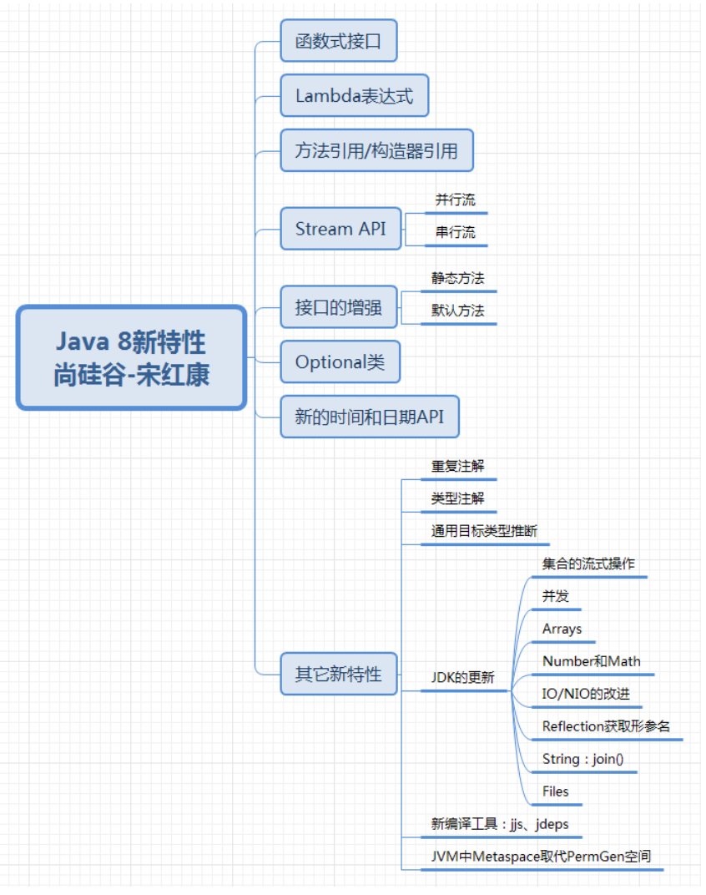

# Java新特性


**Java版本发布特点: 小步快跑，快速迭代**
* Java5.0   最重要的里程碑式版本
* Java8.0   第二重要的里程碑式版本
* Java9.0   从9.0开始，每半年更新一次
* Java11.0  LTS, 2018.9
* Java17.0  LTS, 2021.9

JEP(JDK Enhancement Proposals): JDK改提案。每当有新的设想的时候，JEP可以提出非正式的规范(specification)，被正式认可的JEP正式写进JDK的发展路线图并分配版本号。

LTS(Long-term Support): 长期支持。

### 如何学习新特性？
1. 新的语法规则(多关注)
   1. 比如自动装箱、自动拆箱，注解，enum，Lambda表达式，方法引用，switch表达式，try-catch变化，record等
2. API层面: 增加，过时，删除API
   1. StringBuilder, ArrayList, 新的日期时间的API, Optional
3. 底层的优化, JVM参数的调整, GC的变化, 内存结构(永久代-->元空间)


## 1. Lambda表达式
* `->`: Lambda操作符，箭头操作符。
* `->`的左侧: Lambda的形参列表，对应着要重写的接口中的抽象方法的形参列表。
* `->`的右侧: Lambda体，对应着接口的实现类要重写的方法的方法体。

`Lambda形参列表 -> Lambda体`

### 1.1 Lambda表达式的本质
```java
Comparator<Integer> comparator1 = (o1, o2) -> {
            System.out.println(o1);
            System.out.println(o2);
            return Integer.compare(o1, o2);
        };
```
1. 一方面，Lambda表达式作为**接口**实现类的对象 --> 万事万物皆对象
   * 这些接口只有一个方法, 即**函数式接口**
2. 两一方面，Lambda表达式是一个匿名函数

### 1.2 函数式接口
1. 如果接口中只有一个抽象方法，则此接口就被称为函数式接口。
2. 因为只有给函数式接口提供实现类的对象时，我们才可以使用Lambda表达式。`@FunctionalInterface`

### 1.3 JDK API中函数式接口的包
> Functional interfaces provide target types for lambda expressions and method references. Each functional interface has a single abstract method, called the functional method for that functional interface, to which the lambda expression's parameter and return types are matched or adapted.
* [Package java.util.function](https://docs.oracle.com/en/java/javase/17/docs/api/java.base/java/util/function/package-summary.html)

### ✅1.4 常见的函数式接口: 四大核心函数式接口
1. Consumer<T>: 消费型接口, `void accept(T t)`
2. Supplier<T>: 供给型接口, `T get()`
3. Function<T, R>: 函数型接口, `R apply(T t)`
4. Predicate<T>: 判断型接口, `boolean test(T t)`

### 1.5 Lambda表达式语法规则总结
* 左边: Lambda的形参列表，参数的类型可以省略。如果形参只有一个，则()也可以省略
* 右边: Lambda体，对应着重写的方法的方法提。如果方法体中只有一行执行语句，则{}可以省略，如果有return关键字，则必须一并省略。
* ⚠️Code Reference: [package `com.atguigu.lambda`](../src/main/java/com/atguigu/lambda)


## 2. 方法引用 & 构造器引用
### 2.1 方法引用
1. 可以看作是基于Lambda表达式的进一步刻画。
2. 当需要提供一个函数式接口时，可以使用Lambda表达式提供此实例
   1. 当满足一定条件时，可以用方法引用or构造器引用替换Lambda表达式。
3. 方法引用的本质: **方法引用**作为了**函数式接口的实例** --> "万事万物皆对象"
   1. `Comparator<Integer> comparator = Integer::compare;`
4. 格式: 类(or对象)::方法名
   1. 对象::实例方法
      * 要求: 函数式接口中的抽象`方法a`与其内部实现时调用的**对象的**某个`方法b`的形参列表和返回值类型都相同(or一致)。此时可以考虑使用方法b实现对方法a的替换和覆盖。此替换或覆盖即为方法引用。
      * ⚠️注意: 此方法b是非静态方法，需要对象调用。
   2. 类::静态方法
      * 要求: 函数式接口中的抽象`方法a`与其内部实现时调用的**类**的某个`静态方法b`的形参列表和返回值类型都相同(or一致)。此时可以考虑使用方法b实现对方法a的替换和覆盖。此替换或覆盖即为方法引用。
      * ⚠️注意: 此方法b是**静态方法**，需要类调用。
   3. 类::实例方法
      * 要求: 函数式接口中的抽象`方法a`与其内部实现时调用的**对象的**某个`方法b`的返回值类型一致，同时，抽象方法a的第一个参数作为方法b的调用者，且抽象方法a的后N-1个参数与方法b的N-1个参数的类型相同or一致，则可以考虑使用方法b实现对抽象方法a的替换/覆盖。此替换/覆盖即为方法引用。
      * ⚠️注意: 此方法b是非静态方法，需要对象调用。但是形式上，写成对象a所属的类
5. :white_check_mark: Code Reference: [package `com.atguigu.reference`](../src/main/java/com/atguigu/reference)

### 2.2 构造器引用
1. 将构造器引用看作特殊的方法引用。
2. 格式: `类名::new`
3. 说明:
   1. 调用了类名对应的类中的某一个确定的构造器
   2. 具体调用的是类中的哪一个构造器？取决于函数式接口的抽象方法的形参列表。
4. :white_check_mark: Code Reference: [package `com.atguigu.reference`](../src/main/java/com/atguigu/reference)

### 2.3 数组引用
1. 格式: `数组类型[]::new`
2. :white_check_mark: Code Reference: [package `com.atguigu.reference`](../src/main/java/com/atguigu/reference)


## 3. Stream API
* Java8中两大最为重要的改变: 第一个是Lambda表达式，另一个就是Stream API
* Stream API(java.util.stream)把真正的函数式编程风格引入到了Java中。这是目前位置对Java类库最好的补充，因为Stream API可以极大提供Java程序员的生产力，让程序员写出高效、干净、简洁的代码。
* Stream 是 Java8 中处理集合的关键抽象概念，它可以指定你希望对集合进行的操作，可以执行非常复杂的查找、过滤和映射数据等操作。**使用Stream API对集合数据进行操作，就类似于使用SQL执行的数据库查询。** 也可以使用 Stream API 来并行执行操作。简言之， Stream API 提供了一种高效且易于使用的处理数据的方式。

### 3.1 什么是Stream
Stream是数据渠道，用于操作数据源（集合、数组等）所生成的元素序列。

**Stream API 和集合框架的区别:**
1. Stream API关注的是多个数据的计算()，面向CPU。集合关注的是数据存储，面向内存。
2. Stream API之于集合，类似于SQL之于数据库标的查询。

⚠️**注意:**
1. Stream自己并不会存储元素。
2. Stream不会改变源对象。相反，它们会返回一个持有结果的新Stream。
3. Stream操作是延迟执行的。这意味着它们会等到需要结果的时候才执行。即一旦执行终止操作，就执行中间操作链，并产生结果。
4. Stream一旦执行了终止操作，就不能再调用其他中间操作或终止操作了。

### 3.2 Stream使用步骤
1. Stream的实例化
   1. 方式一: 通过集合。Java8中`java.util.Collection`接口提供了两个获取Stream的方法
      * `default Stream<E> stream()` 返回一个顺序流
      * `default Stream<E> parallelStream()` 返回一个并行流
   2. 方式二: 通过数组。Java8中Arrays的静态方法`stream()`可以获取数组流
      * `public static <T> Stream<T> stream(T[] array)`
      * `public static IntStream stream(int[] array)`
      * `public static LongStream stream(long[] array)`
   3. 方式三: 通过调用静态方法`Stream.of(...)`，通过显示值创建一个Stream。他可以接收任意数量的参数。
      * `public static<T> Stream<T> of(T t)`
      * `public static<T> Stream<T> ofNullable(T t)`
      * `public static<T> Stream<T> of(T... values)`
2. 一些列的中间操作
   1. 筛选与切片
      * `filter()`
      * `distinct()`
      * `limit()`
      * `skip()`
      * `max()`
      * `min()`
   2. 映射
      * `map(Function f)`
      * `mapToInt(ToIntFunction f)`
      * `mapToDouble(ToDoubleFunction f)`
      * `flatMap(Function f)`: 接收一个函数作为参数，将流中的每个值都换成另一个流，然后把所有流链接成一个流
   3. 排序
      * `sorted()` 产生一个新Stream，自然排序 (⚠️注意: 元素要实现Comparable接口)
      * `sorted(Comparator cmp)` 产生一个新Stream，按照比较器排序
3. 执行终止操作: 
   * 终端操作会从stream的流水线生成结果。其结果可以是任何不是流的值，例如: List, Integer, 甚至是void。
   * **当stream进行了终止操作后，不能再次使用。**
   1. 匹配与查找
      * `allMatch(Predicate p)`
      * `anyMatch(Predicate p)`
      * `nonMatch(Predicate p)`
      * `findFirst()`
      * `findAny()`
      * `count()`
      * `max(Comparator cmp)`
      * `min(comparator cmp)`
      * `forEach(Consumer c)`
   2. 归约
      * `reduce(T identity, BinaryOperator b)`
      * `reduce(BinaryOperator b)` 可以将stream中元素反复结合起来，得到一个值。返回Optional
      * ⚠️注意: Map和Reduce的连接通常称为map-reduce模式，因Google用它进行网络搜索而出名。
   3. 收集
      * `collect(Collector c)` 将stream转换为其他形式。接收一个Collector接口的实现，用于给Stream中元素做汇总的方法。`Collector`接口中方法的实现决定了如何对stream执行收集的操作(如收集到List, Set, Map)。另外，`Collector`实用类提供了很多静态方法，可以方便地创建常见收集器实例。
        * `toList()`
        * `toSet()`
        * `toCollection()`
 

## 4. 新的语法
