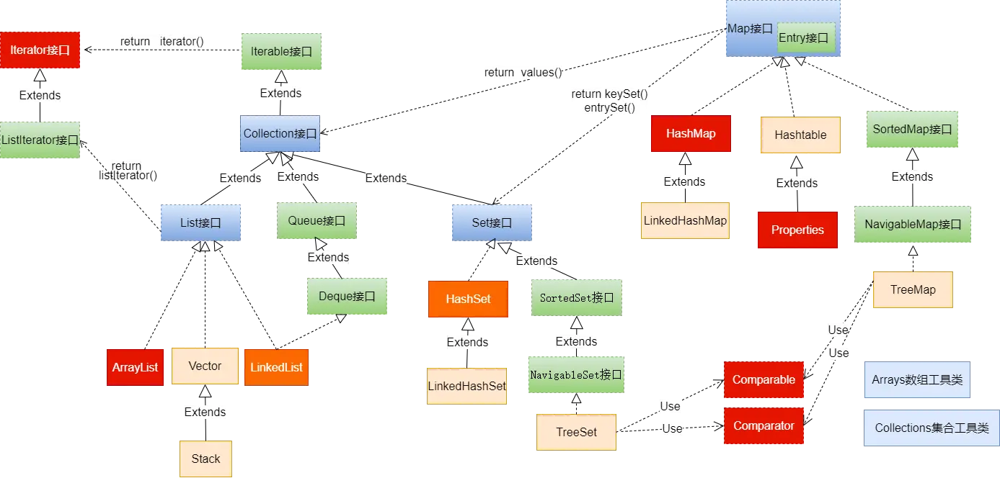

## Java集合框架体系
Java集合可以分为`Collection`和`Map`两大体系：
1. [`interface java.util.Collection<E>`](https://docs.oracle.com/en/java/javase/17/docs/api/java.base/java/util/Collection.html). `Collection`接口用于存储一个一个的数据，也称**单列数据集合**
   1. List 子接口，用来存储有序的、可以重复的数据(主要用来替换数组，可以理解为“动态”数组)
      * 实现类： ArrayList(主要实现类)、 LinkedList、 Vector
   2. Set 子接口，用来存储无序的、不可重复的数据
      * 实现类： HashSet(主要实现类)、 LinkedHashSet、 TreeSet
2. [`interface java.util.Map<K, V>`](https://docs.oracle.com/en/java/javase/17/docs/api/java.base/java/util/Map.html) `Map`接口用于存储具有映射关系"Key-Value"对的集合，即一对一的数据，也称**双列数据集合“。
   * HashMap(主要实现类)、 LinkedHashMap、 TreeMap、 Hashtable、 Properties



* [Java 8 Collection Hierarchy](https://www.falkhausen.de/Java-8/java.util/Collection-Hierarchy.html)
* [Java 8 Map Hierarchy](https://www.falkhausen.de/Java-8/java.util/Map-Hierarchy.html)

## Iterator
* [`interface java.util.Iterator<E>`](https://docs.oracle.com/en/java/javase/17/docs/api/java.base/java/util/Iterator.html)

在程序开发中，经常需要遍历集合中的所有元素。针对这种需求， JDK 专门提供了一个接口`java.util.Iterator`。 `Iterator`接口也是 Java 集合中的一员，但它与 Collection、 Map 接口有所不同。
* Collection接口与Map接口主要用于存储元素
* Iterator，被称为迭代器接口，本身并不提供存储对象的能力，主要用于遍历Collection中的元素
  
Collection接口继承了java.lang.Iterable接口，该接口有一个iterator()方法，那么所有实现了 Collection 接口的集合类都有一个 iterator()方法，用以返回一个实现了 Iterator 接口的对象。


### for-each 循环
foreach 循环（也称增强 for 循环）是 JDK5.0 中定义的一个高级 for 循环，专门用来遍历数组和集合的。
```java
for(元素的数据类型 局部变量 : Collection 集合或数组){
//操作局部变量的输出操作
}
//这里局部变量就是一个临时变量，自己命名就可以

for (int num : nums) {
    System.out.println(num);
}
```
