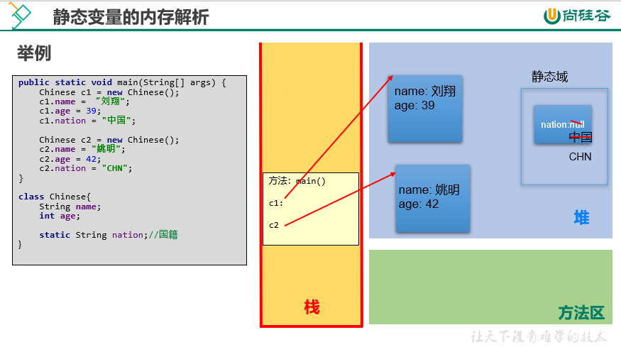

## 关键字`static`
`static`可以修饰的结构：属性(fields), 方法(methods)；代码块, 内部类。

1. `static`修饰属性
   1. 方式1⃣️：按照数据类型：基本数据类型，引用数据类型
   2. 方式2⃣️：按照类中声明的位置：
      1. 成员变量：按照是否使用`static`修饰进行分类：
         * 使用`static`修饰的成员变量：静态变量、类变量
         * 不实用`static`修饰的成员变量：非静态变量、实例变量
      2. 局部变量：构造器形参，构造器内，方法形参，方法内，代买块内等。
2. 静态变量: 类中使用`static`修饰的属性。
3. 静态变量🆚实例变量：
   1. 个数 
    * 静态变量：在内存空间中只有一份，被类的多个对象所共享。
    * 实例变量：类的每一个实例（或对象）都保存着一份实例变量。
   2. 内存位置
    * 静态变量：jdk6及之前：存放在方法区。 jdk7及之后：存放在堆空间
    * 实例变量：存放在堆空间的对象实体中。
   3. 加载时机
    * 静态变量：随着类的加载而加载，由于类只会加载一次，所以静态变量也只有一份。
    * 实例变量：随着对象的创建而加载。每个对象拥有一份实例变量。
   4. 调用者
    * 静态变量：可以被类直接调用，也可以使用对象调用。
    * 实例变量：只能使用对象进行调用。
   5. 判断是否可以调用 ---> 从生命周期的角度解释
       类变量         实例变量
   类       yes            no
   对象     yes            yes
   6. 消亡时机
    * 静态变量：随着类的卸载而消亡
    * 实例变量：随着对象的消亡而消亡
4. `static`修饰方法：(类方法、静态方法) 随着类的加载而加载
* 可以通过`类.静态方法`的方式，直接调用静态方法
* 静态方法内可以调用静态的属性或静态的方法。（属性和方法的前缀使用的是当前类，可以省略）
* 不可以调用非静态的结构。（比如：属性、方法）
    >                     类方法         实例方法
    >          类            yes            no
    >          对象          yes            yes
* `static`修饰的方法内，不能使用this和super
* 补充：在类的非静态方法中，可以调用当前类中的静态结构（属性、方法）或非静态结构（属性、方法）
5. 开发中，什么时候需要将属性声明为静态的？
   * 判断当前类的多个实例是否能共享此成员变量，且此成员变量的值是相同的。
   * 开发中，常将一些常量声明是静态的。比如：Math类中的PI
6. 什么时候需要将方法声明为静态的？
   * 方法内操作的变量如果都是静态变量（而非实例变量）的话，则此方法建议声明为静态方法
   * 开发中，常常将工具类中的方法，声明为静态方法。比如：Arrays类、Math类

