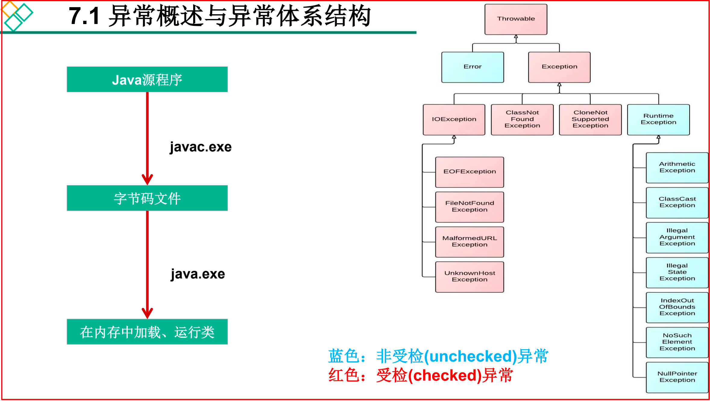

# Chap07. 异常处理

## 1. 异常概述与异常体系结构
* **异常:** 在 Java 语言中，将程序执行中发生的不正常情况称为“异常”。注意：开发过程的语法错误和逻辑错误不是异常。
* `java.lang.Throwable` 顶级父类（所有异常共同的祖先）
  * https://docs.oracle.com/en/java/javase/17/docs/api/java.base/java/lang/Throwable.html
* Java 程序在执行过程中所发生的异常事件可分为两类：
  * `java.lang.Error`: Java虚拟机无法解决的严重问题。如：JVM系统内部错误、资源耗尽等严重情况。比如： StackOverflowError 和OOM。一般不编写针对性的代码进行处理。 
    * [ErrorTest.java](../JavaBasics/src/main/java/com/ylqi007/chap09exception/ErrorTest.java)
  * `java.lang.Exception`: 其它因编程错误或偶然的外在因素导致的一般性问题，可以使用针对性的代码进行处理。如： 
    * 空指针访问 
    * 试图读取不存在的文件 
    * 网络连接中断 
    * 数组角标越界
* 处理：对于这些错误，一般有两种解决方法
  * 一种是遇到错误就终止程序的运行。
  * 另一种是由程序员在编写程序时，就考虑到错误的检测、错误消息的提示，以及错误的处理
* 捕获异常最理想的是在编译期间，但有的错误只有在运行时才会发生。比如：除数为0，数组下标越界等。
  * 分类：编译时异常 & 运行时异常




理解: 异常处理的根本目的，还是想让程序继续运行下去。比如，某一块代码出现了异常，但是我想看一下后面的代码运行情况，就可以先处理掉异常，让后面的程序继续运行。


## 2. 常见异常


## 异常处理
### 抓抛模型
1. 过程1️⃣：“抛”：程序在正常执行过程中，一旦出现异常，就会在异常代码处生成一个对应异常类对象，并将此对象抛出。一旦抛出异常后，其后的代码就不再执行了。
   关于异常对象的产生：
   1. 系统自动生成的，比如 NullPointerException, IOException
   2. 手动生成一个异常对象，并抛出 (`throw XxxException`)
2. 过程2️⃣：“抓”：可以理解为异常的处理方式
   1. try-catch-finally
   2. throws

Java 采用的是**异常处理机制**，是将异常处理的程序代码集中在一起，与正常的程序代码分开，使得程序简洁、优雅，并易于维护。
1. try-catch-finally
2. throws + 异常类型


## 3. 异常处理机制1: try-catch-finally ✅
```java
try {
    // 可能出现异常的代码    
} catch (NullPointerException e) {
    // 
} catch (Exception e) {
    // 
} finally {
    // 一定会执行的代码
}
```

## 4. 异常处理机制2: throws ✅


## 5. 手动抛出异常: throw


## 6. 用户自定义异常类


## Reference
* [Java之异常处理 ](https://juejin.cn/post/6961298842553696286)